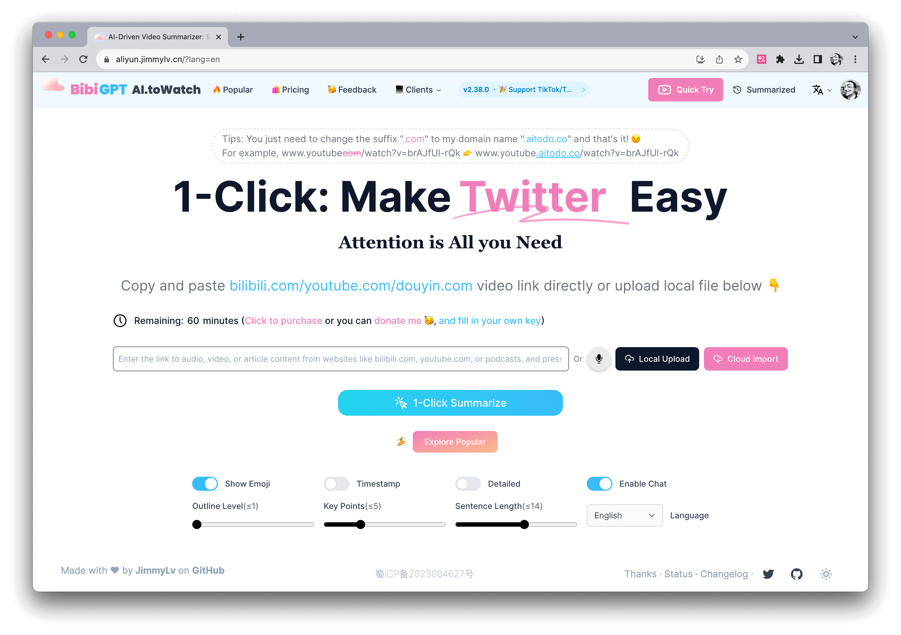
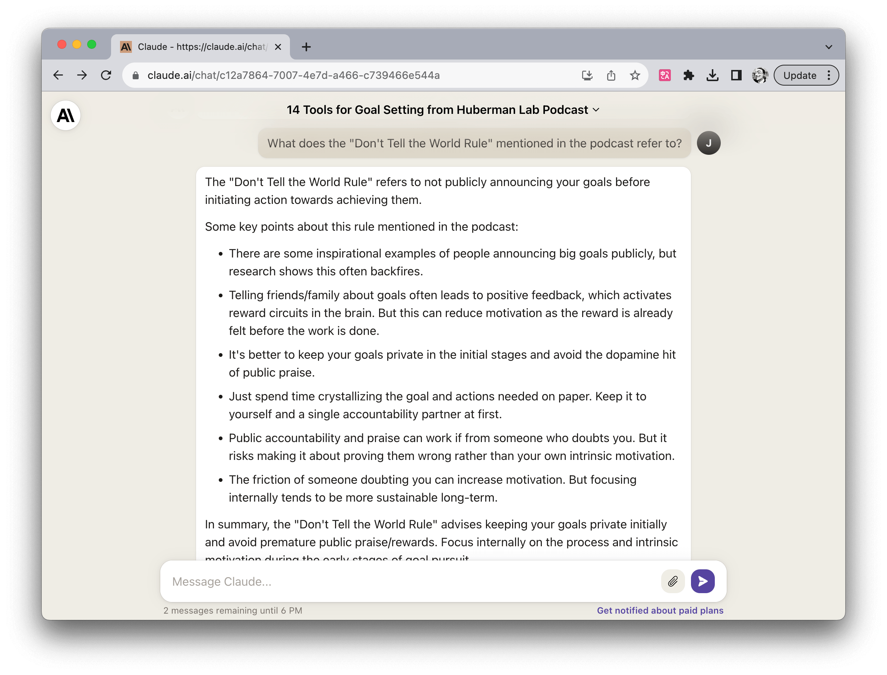

# Using AI tools to listen to podcasts and watch videos

Author：JimmyWong

If you have any great ideas, feel free to join our [Discord channel](https://discord.gg/B7Z7wjuUPg) for sharing purposes 😁

## The Problem

Due to my interest, I often listen to English podcasts and watch English videos. However, some podcasts or videos are quite specialized, so it is difficult for me to understand, especially podcasts with heavy accents. I often encounter situations where I can't understand. This leads to needing to listen repeatedly or look up words in the dictionary, which wastes a lot of time. 

My previous solution was to download the subtitles of the podcasts or videos and watch while listening, and use translation software for parts I don't understand. But this method is not efficient. 

This year, with the emergence of ChatGPT, more and more AI tools related to it have appeared, one of which is AI summarization of podcasts and videos, which has attracted a lot of attention. I have also tried many tools, experimented for a long time, and finally summarized three methods that can significantly improve AI summarization accuracy. I hope it can help everyone.

## Solution

### 1. Selecting podcasts or videos suitable for AI summarization

First of all, based on my experience, not all podcasts or videos are suitable for AI summarization or translation because AI does not know what is important. The effect of AI summarization is not very good for podcasts that are more like casual conversations or interviews. Based on my experiments so far, I believe that podcasts or videos with a **"clear theme"** are more suitable for AI summarization. 

Take the Huberman Lab podcast that I often listen to as an example. His podcast mainly consists of two types: one is Dr. Andrew Huberman speaking alone, and the other is interviews with other people. The themes of the former are more explicit, such as the theme of the first episode shown in the image below, "How to Achieve Goals." Such podcasts are more suitable for AI summarization. The latter, although the themes are relatively clear, still have a lot of casual conversations during the interviews, so the effect of AI summarization is not as good. 

 

Here are a few more examples of podcasts or videos that are more suitable for AI summarization: 

- TED videos 
- Mobile or tech product review videos 
- News or current affairs podcasts or videos

### 2. Summarization by paragraphs

If you can find a podcast or video suitable for AI summarization, the next step is how to use AI summarization. Currently, there are two mainstream methods. 

The first method is to download the subtitles of the podcast or video, and then input the subtitles into an AI tool for summarization. The second method is to directly input the URL of the podcast or video into an AI tool for summarization. 

For the first method, I usually use [Claude](https://claude.ai/) because it has a larger maximum token and is more suitable for long podcasts or videos. However, its drawback is that if the podcast or video is long, it will summarize the entire content as a whole, resulting in the loss of a lot of information. However, if the video you want to summarize is short and focused, like some TED Talk videos, using [Claude](https://claude.ai/) for summarization is a good choice. 

The second method does not require downloading subtitles, you can directly input the URL of the podcast or video into an AI tool for summarization. In this case, the AI tool will automatically segment the podcast or video and summarize each paragraph. This way, the summarization will be more accurate. For example, [TammyAI](https://tammy.ai/)：is a tool that summarizes based on paragraphs, so the generated summary is more accurate. 

If you watch a lot of Bilibili, you can also try [BibiGPT](https://bibigpt.co/):

However, these segmented summarization tools may miss some parts. Therefore, I also use a third method. 

### 3. Combine show notes for further inquiries

If you are using a segmented AI summarization tool, you can combine it with show notes for further inquiries. For example, in the show notes of the Huberman Lab podcast episode on "How to Achieve Goals", it states that there are 14 tools discussed in the episode that can help you achieve your goals, and the names of each tool are also listed. 

You can ask the AI tool, "What does the Don't Tell the World Rule mentioned in the podcast refer to?" 

With this method, I have increased the efficiency of listening to podcasts and watching videos by 2-3 times. However, please note that even with the use of further inquiries, the content generated by the AI summarization may not be 100% accurate, so if possible, you can also refer to the original subtitles.