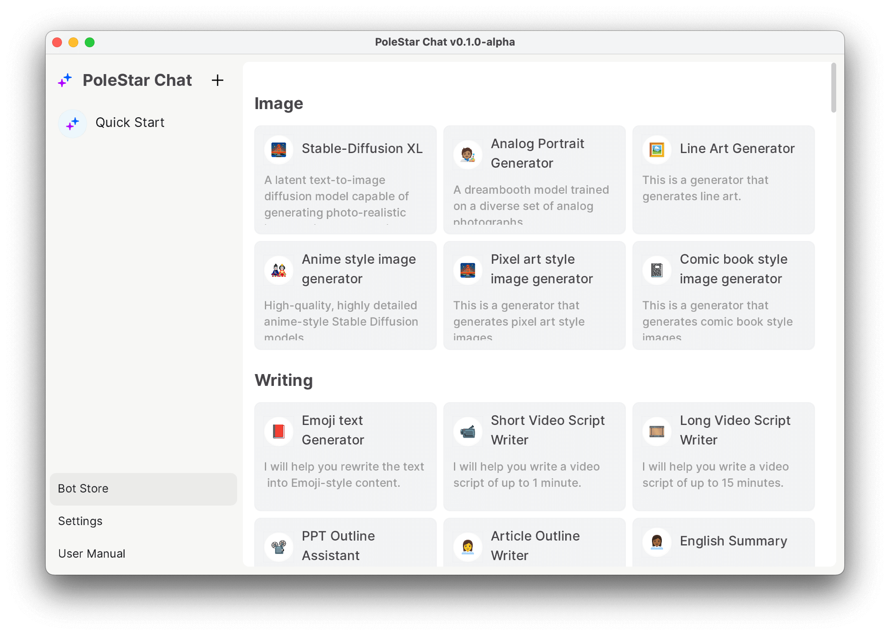

# Using AI to Prepare for the IELTS Speaking Exam

Author：JimmyWong

If you have any great ideas, feel free to join our [Discord channel](https://discord.gg/B7Z7wjuUPg) for sharing purposes 😁

## The Problem

The IELTS Speaking test is divided into the following sections: 

- Part 1: The examiner will ask the candidates to introduce themselves and ask them some personal questions, such as their identity, interests, and hobbies. 

- Part 2: The examiner will give the candidates a task card, a pencil, and some paper for taking notes. The task card will provide a topic and some key questions. The candidates will have 1 minute to prepare and then 2 minutes to speak according to the requirements on the task card. 

- Part 3: Q&A. The examiner will ask further questions about the topic in Part 2, and the candidates need to answer the examiner's questions. In the speaking test, Part 2 is somewhat similar to a spoken essay question. 

Here is an example of a real speaking test question:

> Describe a car journey that you remember well. You should say:
> - When it was：
> - Where you went：
> - What did you do：
> - Who was with you：
> - And explain how you felt about the journey：

Because Part 2 has a question bank, most candidates will prepare in advance. The usual practice is to handwrite an essay based on the topic requirements before the exam, and then memorize or recite it, so as to quickly complete the presentation during the exam. However, candidates often encounter the following problems during preparation: 

1. There are many topics and they need to prepare a lot of content. 
2. The content they write is not good enough and they need someone to help correct it. 

Therefore, many candidates choose to pay for templates. These templates are usually written by specialized teachers (some even by foreign teachers), and the quality of the content is relatively high. 

However, there are drawbacks: 
1. The price is generally expensive. 
2. Because this kind of service caters to many students, it cannot guarantee completely unique content. 3. It is difficult to personalize the content, resulting in difficulties in memorization (of course, if you are willing to pay more money, there are services that provide customization).

## Basic Solution

Recently, I learned that a friend of mine used an AI tool to assist in preparing for the IELTS Speaking test. According to the tests conducted by several friends of mine, compared to writing the content themselves, **it can improve their scores by 0.5-1.0 points**, and it can save a lot of preparation time. In addition, you don't need to spend money to have someone else write for you. I also tried this approach and found that it worked well, so I am sharing it here. 

Using the previous topic as an example, we can first write our answer in your language (it is best to use our own real experience, so that it will be easier to memorize or recite), here is a Chinese version:

> Describe a car journey that you remember well. You should say:
> - When it was：两年前的秋天
> - Where you went：新疆
> - What did you do：租了一辆车，从乌鲁木齐自驾到北疆，一路上经过不同的风景点，花了 6 天时间
> - Who was with you：两个好朋友
> - And explain how you felt about the journey：一直想去新疆自驾游，终于实现梦想，很兴奋；看到美丽的自然风光，很震撼

Then, input the topic and the written answer into the AI tool, and you will get a sample essay.


Then you can modify the generated content according to your own situation, for example, deleting some content (because there's limited speaking time and you can't say so much), or adding some frequently used high-scoring oral words. Additionally, according to your preference, you can also mark unfamiliar words for reference.


## Advanced Solution

Because there are so many questions in the question bank, it would be too much to memorize if we had to write an essay for each question. So there is an advanced solution. First, you can list all the questions in a note-taking tool and categorize them, like this:


After organizing the categories, you can classify similar topics. For example, in the picture above, the last two topics are related - one is about car travel and the other is about cities. 

So, for the topic you're preparing, it could be about taking a road trip to a famous city. You can input this combined topic into an AI tool and then modify it according to your own situation. This way, instead of needing to prepare dozens of spoken essays, you only need to prepare a few, greatly reducing the amount of memorization required. 

Additionally, there is currently an issue where it's relatively difficult to control the number of characters generated by AI. Therefore, you need to delete some of the generated content based on your own situation in order to better control the time during the exam. Another suggestion is to have AI generate multiple essays and then compare them to select the best one. 

To make it easier for everyone to compare results, our product PoleStar Chat supports multiple tab displays after clicking "retry," so you can conveniently compare them.


## Prompt

My prompt is quite simple, with the main variables being scores and character count. You can change it according to your needs. However, the character count control is not very accurate. I have tried several methods but they are not ideal. If there are better methods later, I will iterate again. 

```
Please write a spoken English script that can achieve a score of 7 in the IELTS speaking test. 
The length should be around 200-220 English words. 
It is required to use vocabulary and language appropriate for a score of 7 in the IELTS speaking test. 
The prompt and requirements are as follows:
```

You can also download our application to directly use this prompt. Currently, our app provides over 100 different prompt templates.



Lastly, feel free to join our [Discord ](https://discord.gg/B7Z7wjuUPg)to share the prompts you create.