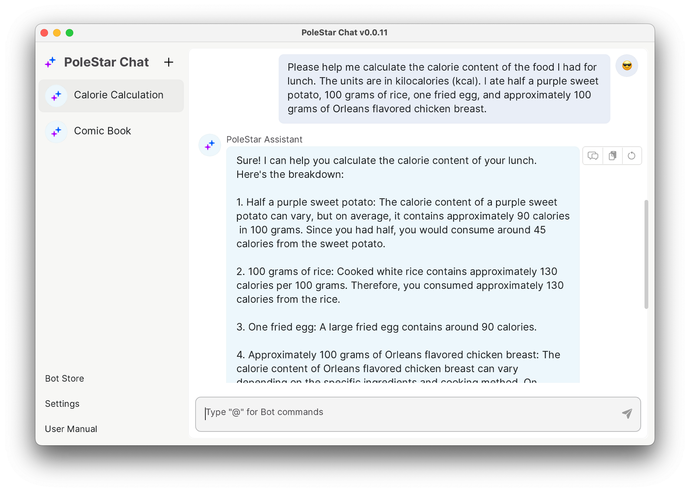
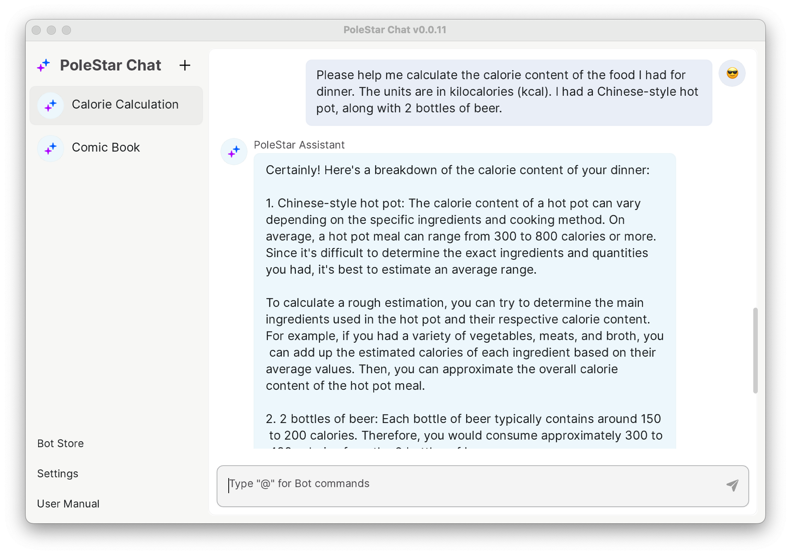
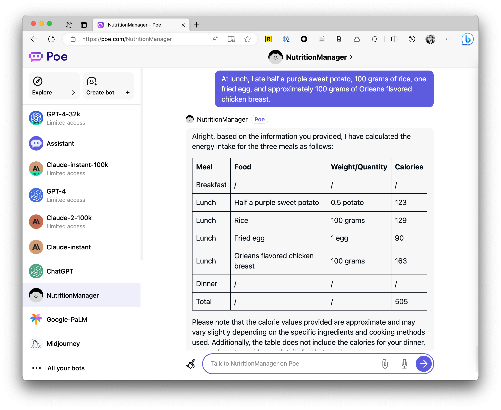
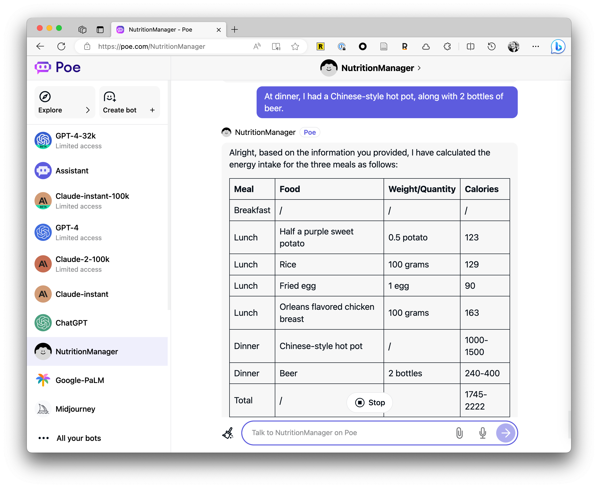

# Use AI to Track Daily Calorie Intake


Author：JimmyWong

If you have any great ideas, feel free to join our [Discord channel](https://discord.gg/B7Z7wjuUPg) for sharing purposes 😁

## The Problem

Over the past six months, I have been on a weight loss journey, and creating a calorie deficit is a critical aspect of it. Besides the commonly known method of exercising more, controlling one's diet is also essential. However, I have tried numerous calorie tracking apps, but none of them were able to meet my needs.

The main reasons for this are:

1. Most apps have a cumbersome process for recording calorie intake. For example, to record the calorie content of rice, you need to search for rice first and then input the portion you ate. If you had a meal with several different items, it would take at least 3 to 4 minutes to complete the entire process.
2. Some of dishes are complex to track. How do you log hotpot for example? Weighing each ingredient isn't practical.

The tedious process and tracking difficulties caused me to eventually abandon them.

## Basic Solution

Recently I saw people using AI for calorie tracking with great convenience - it solved my problems above.

You simply describe what you ate in text, and the AI tallies it up. For example, here's what I had for lunch today. Traditional apps would take 3-4 minutes just to log this. Don't worry about inaccurate data - I checked against other apps and the AI is pretty close, especially if you use precise quantities which I'll show later:



It also handles tricky cases like hotpot. Just add more or be more specific if you ate a lot:



You can log the data wherever you track things, like Notion for me.

Here's how I calculate my deficit: Deficit = Total intake - Total burn = Meals - (RMR + Exercise). I use the [RMR methord](https://purecalculators.com/zh-CN/rmr-resting-metabolic-rate-calculator), but [BMR](https://purecalculators.com/zh-CN/bmr-calculator) works too. And don't forget to reward yourself after logging:


## Advanced Solution

If you find the tracking process intimidating, you can try using AI to generate a Markdown format list of various nutritional components that you need to record. Then, you can manually copy and paste them into your document tool. At the same time, AI can provide suggestions after each meal:



After recording your lunch, you can continue inputting your dinner, and AI will keep track in a table format:



Moreover, if you closely analyze the calorie data, you will notice that there is always a slight discrepancy in the calorie calculations provided by AI.

After multiple tests, I found that it was mainly due to the issue of measurements. If you input vague quantities like "half" or "a bowl," the results from AI may vary slightly each time. However, I don't think it's a major problem as the differences between multiple results are minimal. Unless you're preparing for a competition, everyday use should suffice.

If you're still not satisfied with the results, you can try GPT-4. Based on my testing, GPT-4 is the most accurate model currently available.

## Prompt

Here's an example of my prompt:

```
As a professional nutritionist, please help me calculate and track my nutritional intake in kcal using Markdown tables based on my meal entries. I will provide each meal separately. Requirements:
1. Log everything in one table with meal as the first column.
2. If unsure of exact calories, provide a range.
3. Only include what I tell you I ate.
Lastly, provide reasonable diet suggestions.
```

Additionally, you can include personal data such as weight and height for more accurate recommendations from AI. If you encounter unsatisfactory results, don't panic. Make gradual adjustments, and eventually, you will achieve the desired outcome.

Lastly, feel free to join our [Discord ](https://discord.gg/B7Z7wjuUPg)to share the prompts you create.
