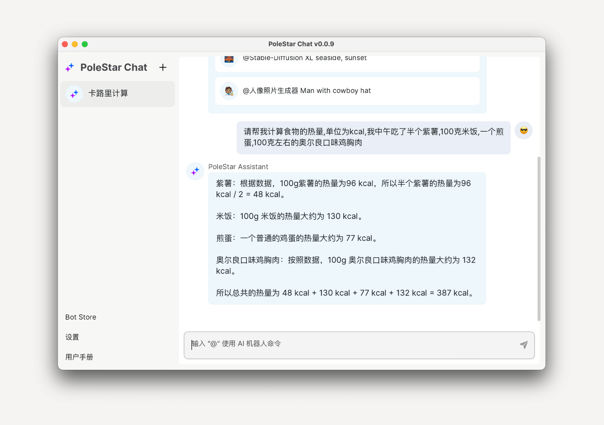
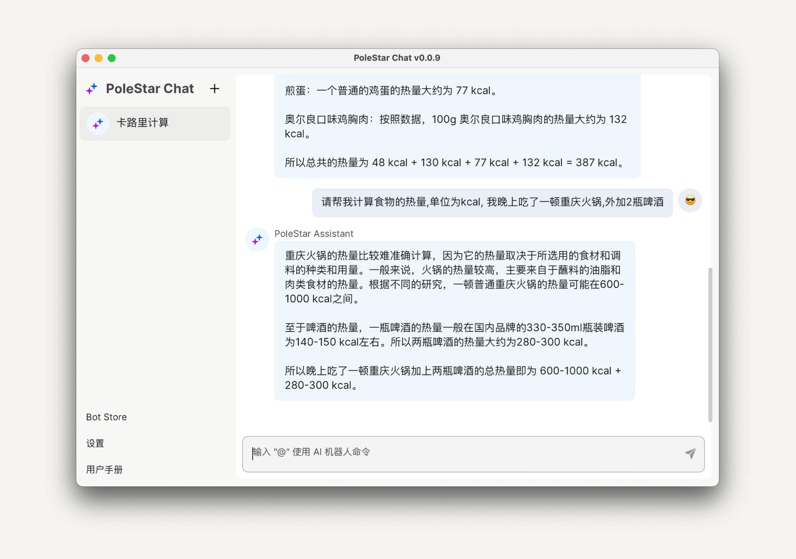
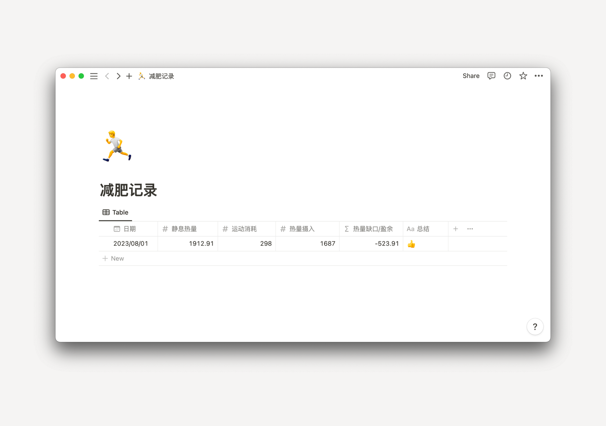
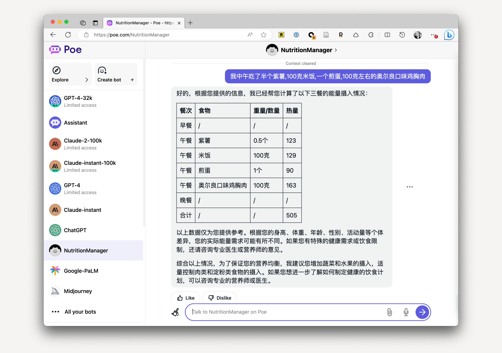
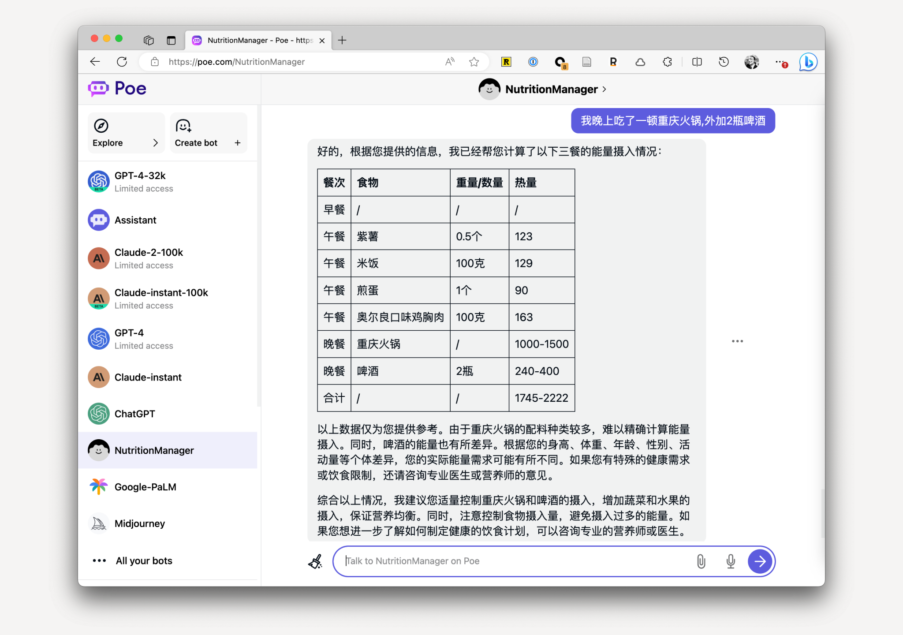

# 🧮 使用 AI 记录每日热量摄入

import recordCalories06 from '../../assets/img/record-calories-06.png'

作者：JimmyWong

如果你也有不错的想法，欢迎加入我们的 [Discord 频道](https://discord.gg/B7Z7wjuUPg)进行分享 😁

## 问题

最近半年我一直在减肥，而减肥的关键则是制造热量缺口。制造热量缺口的方法，除了大家熟知的多运动外，还有就是控制饮食。为了精确计算热量的缺口，我尝试过很多计算热量的 App，都没法坚持。

有两个关键原因：

1. 大多数 App 记录热量的流程比较繁琐，比如记录米饭的热量，你还需要先搜索米饭，然后输入你吃的分量的，如果你一顿饭吃了很多东西，完成整个录入过程最少也要 3、4 分钟。
2. 中餐做法复杂，数据非常难统计，比如你出去吃一顿火锅，该如何统计呢？不可能每吃一道菜都进行一次称重吧。

操作繁琐，外加统计困难，导致我坚持了一段时间后就放弃了。

## 初阶方案

最近我看到有人使用 AI 工具记录热量，试用了下，效果非常好，非常方便，基本解决我上述提到的两个问题。

首先你可以通过文字输入你吃了什么东西，然后让 AI 帮你统计，比如今天中午我就吃了以下几样东西，如果用传统的热量记录 App，估计光记录就要 3、4 分钟。BTW，你可能担心里面的数据不对，我用一些热量计算 App 查了下，AI 的结果基本跟那些 App 里的结果大差不差，不过需要注意，量词越精准，结果一致性会越好，这个后面会有案例提到：



当然还有前面提到的统计困难的火锅的例子，AI 也能给出答案，如果你吃得比较多，就酌情自己加一些，或者描述精确一些：



接着你就可以将这些统计的数据记录到各种文档工具里，方便后续的统计和回顾。我的习惯是记录在 Notion 里。

另外，再分享一个我的热量缺口计算方法，热量缺口 = 总摄入量 - 总消耗量 = 三餐摄入 -（静息代谢 + 运动消耗）。我这静息代谢用的是 [RMR 方法](https://purecalculators.com/zh-CN/rmr-resting-metabolic-rate-calculator)，你也可以使用 [BMR 方法](https://purecalculators.com/zh-CN/bmr-calculator)。最后记得每次记录完，给自己点个赞：



## 进阶方案

如果你嫌数据统计麻烦的话，你也可以试试让 AI 用 Markdown 格式列出需要记录的各种营养成分，然后自己再手动复制黏贴到文档工具里。同时你还能让 AI 在每顿饭的记录后面加入一些建议：



记录完中餐后，还可以继续输入晚餐，AI 会继续在一个表格内记录：



另外，如果你细看卡路里数据，你会发现 AI 给的卡路里的数据每次都稍微有点偏差。

经过我多次测试，主要还是因为剂量的问题，如果你输入的是「半个」、「一碗」等不太精准的量词，AI 的每次结果可能就会不太一样。不过我觉得问题不大，多次的结果差不了特别多。我又不是备赛，单纯日常记录够用了。
如果你对结果还是不太满意，可以试试 GPT-4，经过我的测试，GPT-4 是目前几个模型中准确性最高的。

## Prompt

我的 prompt 是这样的：

```
做为一名专业营养管理师。请根据我提供的三餐饮食记录，帮助我计算营养的摄入，单位 kcal，并使用 Markdown 表格展示。
另外我会分别给你我三餐的饮食，以下是我的要求：

1. 你需要将当天的所有摄入都记录到同一个表格里，表格第一列为餐次。
2. 如果无法提供具体的热量数据，则提供一个区间热量即可。
3. 注意你仅记录与计算我告诉你的饮食。

最后给我一些合理的饮食建议。
```

另外，你也可以加一些个人的数据，比如体重、身高等等。这样 AI 给的建议会更加准确。如果遇到效果不好的情况，不要慌，一点点改，最终会改好的。

最后也欢迎各位加入我们的 [Discord 频道](https://discord.gg/B7Z7wjuUPg)，分享你写的 Prompt。

## 特别鸣谢

特别鸣谢即刻用户阿禅的分享，原始想法来源于他：


