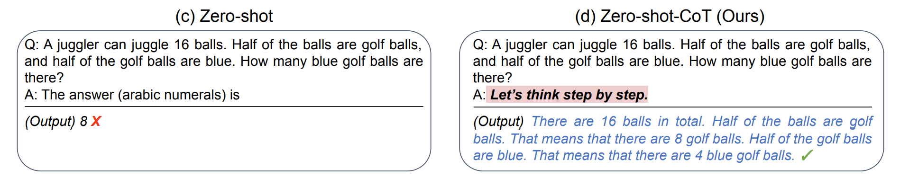

<head>
  <script defer="defer" src="https://embed.trydyno.com/embedder.js"></script>
  <link href="https://embed.trydyno.com/embedder.css" rel="stylesheet" />
</head>

在基础篇里的推理场景，我提到了 Zero-Shot Prompting 的技术，本章会详细介绍它是什么，以及使用它的技巧。

## 介绍

Zero-Shot Prompting 是一种自然语言处理技术，可以让计算机模型根据提示或指令进行任务处理。各位常用的 ChatGPT 就用到这个技术。

传统的自然语言处理技术通常需要在大量标注数据上进行有监督的训练，以便模型可以对特定任务或领域进行准确的预测或生成输出。相比之下，Zero-Shot Prompting 的方法更为灵活和通用，因为它不需要针对每个新任务或领域都进行专门的训练。相反，它通过使用预先训练的语言模型和一些示例或提示，来帮助模型进行推理和生成输出。

举个例子，我们可以给 ChatGPT 一个简短的 prompt，比如 `描述某部电影的故事情节`，它就可以生成一个关于该情节的摘要，而不需要进行电影相关的专门训练。

## 缺点

但这个技术并不是没有缺点的：

1. Zero-Shot Prompting 技术依赖于预训练的语言模型，这些模型可能会受到训练数据集的限制和偏见。比如在使用 ChatGPT 的时候，它常常会在一些投资领域，使用男性的「他」，而不是女性的「她」。那是因为训练 ChatGPT 的数据里，提到金融投资领域的内容，多为男性。
2. 尽管 Zero-Shot Prompting 技术不需要为每个任务训练单独的模型，但为了获得最佳性能，它需要大量的样本数据进行微调。像 ChatGPT 就是一个例子，它的样本数量是过千亿。
3. 由于 Zero-Shot Prompting 技术的灵活性和通用性，它的输出有时可能不够准确，或不符合预期。这可能需要对模型进行进一步的微调或添加更多的提示文本来纠正。

## 技巧 7：Zero-Shot Chain of Thought

基于上述的第三点缺点，研究人员就找到了一个叫 Chain of Thought 的技巧。

这个技巧使用起来非常简单，只需要在问题的结尾里放一句 `Let‘s think step by step` （让我们一步步地思考），模型输出的答案会更加准确。

这个技巧来自于 Kojima 等人 2022 年的论文 [Large Language Models are Zero-Shot Reasoners](https://arxiv.org/abs/2205.11916)。在论文里提到，当我们向模型提一个逻辑推理问题时，模型返回了一个错误的答案，但如果我们在问题最后加入 `Let‘s think step by step` 这句话之后，模型就生成了正确的答案：



论文里有讲到原因，感兴趣的朋友可以去看看，我简单解释下为什么（🆘 如果你有更好的解释，不妨反馈给我）：

1. 首先各位要清楚像 ChatGPT 这类产品，它是一个统计语言模型，本质上是基于过去看到过的所有数据，用统计学意义上的预测结果进行下一步的输出（这也就是为什么你在使用 ChatGPT 的时候，它的答案是一个字一个字地吐出来，而不是直接给你的原因，因为答案是一个字一个字算出来的）。
2. 当它拿到的数据里有逻辑，它就会通过统计学的方法将这些逻辑找出来，并将这些逻辑呈现给你，让你感觉到它的回答很有逻辑。
3. 在计算的过程中，模型会进行很多假设运算（不过暂时不知道它是怎么算的）。比如解决某个问题是从 A 到 B 再到 C，中间有很多假设。
4. 它第一次算出来的答案错误的原因，只是因为它在中间跳过了一些步骤（B）。而让模型一步步地思考，则有助于其按照完整的逻辑链（A > B > C）去运算，而不会跳过某些假设，最后算出正确的答案。

按照论文里的解释，零样本思维链涉及两个补全结果，左侧气泡表示基于提示输出的第一次的结果，右侧气泡表示其收到了第一次结果后，将最开始的提示一起拿去运算，最后得出了正确的答案：


这个技巧，除了用于解决复杂问题外，还适合生成一些连贯主题的内容，比如写长篇文章、电影剧本等。

但需要注意其缺点，连贯不代表，它就一定不会算错，如果其中某一步骤算错了，错误会因为逻辑链，逐步将错误积累，导致生成的文本可能出现与预期不符的内容。

另外，根据 Wei 等人在 [2022 年的论文](https://arxiv.org/pdf/2201.11903.pdf)表明，它仅在大于等于 100B 参数的模型中使用才会有效。如果你使用的是小样本模型，这个方法不会生效。

---

2023-04-12 更新（感谢[qq-740943515](https://github.com/qq-740943515)分享）：
根据 Yongchao Zhou 等人的[最新论文](https://sites.google.com/view/automatic-prompt-engineer)，更好的 prompt 是：

```
Let's work this out in a step by step way to be sure we have the right answer.
```

---

在吴恩达的 ChatGPT Prompt Engineering [课程](https://www.deeplearning.ai/short-courses/chatgpt-prompt-engineering-for-developers/)中，有提到一个这个技巧的另一种用法，不仅仅只是让 AI 按步骤行事，还会告知 AI 每一步要做什么。比如这个案例（注意这个是 python 代码）：

```
prompt_2 = f"""
Your task is to perform the following actions:
1 - Summarize the following text delimited by
  <> with 1 sentence.
2 - Translate the summary into French.
3 - List each name in the French summary.
4 - Output a json object that contains the
  following keys: french_summary, num_names.

Use the following format:
Text: <text to summarize>
Summary: <summary>
Translation: <summary translation>
Names: <list of names in Italian summary>
Output JSON: <json with summary and num_names>

Text: <{text}>
"""
```

简单解释下这个代码：

1. 开头是让 AI 按照 1 ～ 4 步运行
2. 然后再让 AI 根据特定格式输出内容

最后 AI 的输出是这样的：

```
Summary: Jack and Jill go on a quest to fetch water, but misfortune strikes and they tumble down the hill, returning home slightly battered but with their adventurous spirits undimmed.
Translation: Jack et Jill partent en quête d'eau, mais la malchance frappe et ils dégringolent la colline, rentrant chez eux légèrement meurtris mais avec leurs esprits aventureux intacts.
Names: Jack, Jill
Output JSON: {"french_summary": "Jack et Jill partent en quête d'eau, mais la malchance frappe et ils dégringolent la colline, rentrant chez eux légèrement meurtris mais avec leurs esprits aventureux intacts.", "num_names": 2}
```

上述的案例只是将任务拆解，能让 AI 生成的结果更加符合要求，这个方法同样能提升 AI 的回答准确性，比如这个案例：

```
Determine if the student's solution is correct or not.

Question:
I'm building a solar power installation and I need help working out the financials.

Land costs $100 / square foot

I can buy solar panels for $250 / square foot

I negotiated a contract for maintenance that will cost \
me a flat $100k per year, and an additional $10 / square foot
What is the total cost for the first year of operations
as a function of the number of square feet.

Student's Solution:
Let x be the size of the installation in square feet.
Costs:

Land cost: 100x

Solar panel cost: 250x

Maintenance cost: 100,000 + 100x
Total cost: 100x + 250x + 100,000 + 100x = 450x + 100,000

```

AI 的回答是「The student's solution is correct」。但其实学生的答案是错误的，应该 360x + 100,000，我们将 prompt 调整成这样：

```python
prompt = f"""
Your task is to determine if the student's solution \
is correct or not.
To solve the problem do the following:
- First, work out your own solution to the problem.
- Then compare your solution to the student's solution \
and evaluate if the student's solution is correct or not.
Don't decide if the student's solution is correct until
you have done the problem yourself.
Use the following format:
Question:
###
question here
###
Student's solution:
###
student's solution here
###
Actual solution:
###
steps to work out the solution and your solution here
###
Is the student's solution the same as actual solution \
just calculated:
###
yes or no
###
Student grade:
###
correct or incorrect
###
Question:
###
I'm building a solar power installation and I need help \
working out the financials.
- Land costs $100 / square foot
- I can buy solar panels for $250 / square foot
- I negotiated a contract for maintenance that will cost \
  me a flat $100k per year, and an additional $10 / square \
  foot
  What is the total cost for the first year of operations \
  as a function of the number of square feet.
###
Student's solution:
###
Let x be the size of the installation in square feet.
Costs:
1. Land cost: 100x
2. Solar panel cost: 250x
3. Maintenance cost: 100,000 + 100x
   Total cost: 100x + 250x + 100,000 + 100x = 450x + 100,000
###
Actual solution:
"""
```

本质上，也是将任务分拆成多步，这次 AI 输出的结果是这样的（结果就是正确的了）：

```
Let x be the size of the installation in square feet.

Costs:

1. Land cost: 100x
2. Solar panel cost: 250x
3. Maintenance cost: 100,000 + 10x

Total cost: 100x + 250x + 100,000 + 10x = 360x + 100,000

Is the student's solution the same as actual solution just calculated:
No

Student grade:
Incorrect
```

下一章我们会结合 Few-Shot Chain of Thought 来详细讲讲逻辑链的限制。
