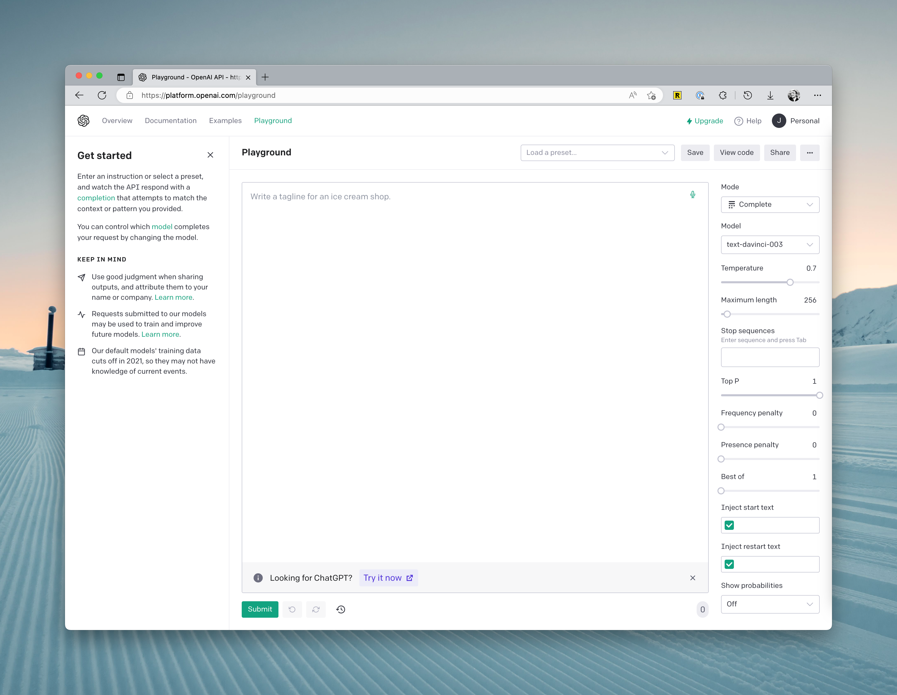

# Using OpenAI Playground

<head>
  
  <link href="https://embed.trydyno.com/embedder.css" rel="stylesheet" />
</head>

If you want to have a better understanding of OpenAI's API and often encounter unavailability of ChatGPT, I recommend using OpenAI Playground. It is more stable.

**However, please note that using the Playground will consume your free credits.**

You will see the following parameters on the right side of the interface:

1. **Mode：** Recently, a fourth Chat mode has been added, but it is generally sufficient to use the Complete mode. Of course, you can use other modes that can assist you in writing prompts through a GUI.
2. **Model：** Here, you can switch between models. Different models excel at different things, so selecting the right model based on the context can save you a lot of costs:
   - Ada: This is the cheapest model with the fastest computation speed. It is recommended for tasks like text analysis, simple classification, and address correction.
   - Babbage: This model can handle more complex scenarios than Ada. It is slightly more expensive but still relatively fast. It is suitable for tasks like classification and semantic search.
   - Curie: According to the official explanation, this model is "similarly powerful to Davinci but cheaper." However, in practice, this model is particularly good at text-related tasks, such as writing articles, language translation, and summarization.
   - Davinci: This is the most powerful model in the GPT-3 series, capable of delivering higher quality and longer answers. Each request can handle 4000 tokens. It is suitable for complex scenarios with intentions, causal relationships, creative generation, search, and summarization.
3. **Temperature：** This primarily controls the randomness of the generated results. In short, the lower the temperature, the more deterministic the results, but they may also be more mundane or uninteresting. If you want to get some unexpected answers, try increasing this parameter. However, if your scenario is fact-based, such as data extraction or FAQ, it is best to set this parameter to 0.
4. **Maximum length:** Set the maximum length of generated content in a single response.
5. **Stop Sequence:** This option sets a specific string sequence that, if found in the generated text, prompts the model to stop generating more text.
6. **Top P:** This option is used for nucleus sampling and controls the probability distribution of the generated text, affecting its diversity and determinism. If you want accurate answers, you can set a lower value. If you want more varied replies, you can set it higher.
7. **Presence Penalty:** This option controls whether the model avoids using specific words or phrases while generating text. It can be useful for generating sensitive topics or specific scenarios.
8. **Best of:** This option allows you to generate multiple texts and select the best one as the output. The default is 1, which means it only generates one output.
9. **Injection start text: ** This option allows you to add custom text at the beginning of the input, thereby influencing the model's generated result.
10. **Injection restart text: ** This option allows you to add custom text at a specific position in the middle, affecting the model's continued generation.
11. **Show probabilities: ** This option allows you to view the probabilities of each word generated by the model. When enabled, you will see a string of numbers following each generated word, indicating the probability assigned by the model to that word.

Once you have configured the parameters, you can enter the prompt on the left and test it out.
