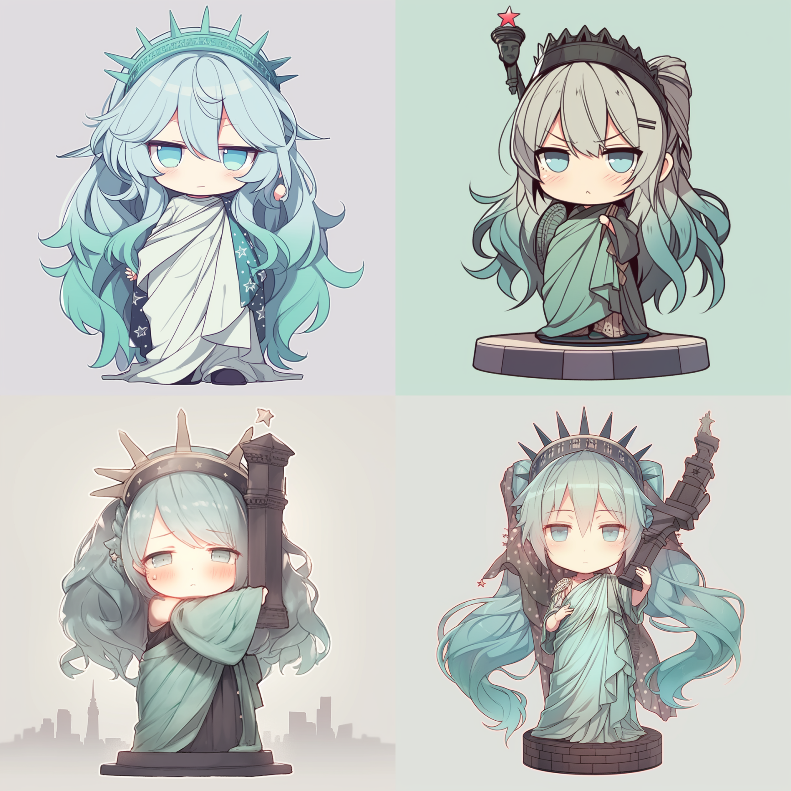
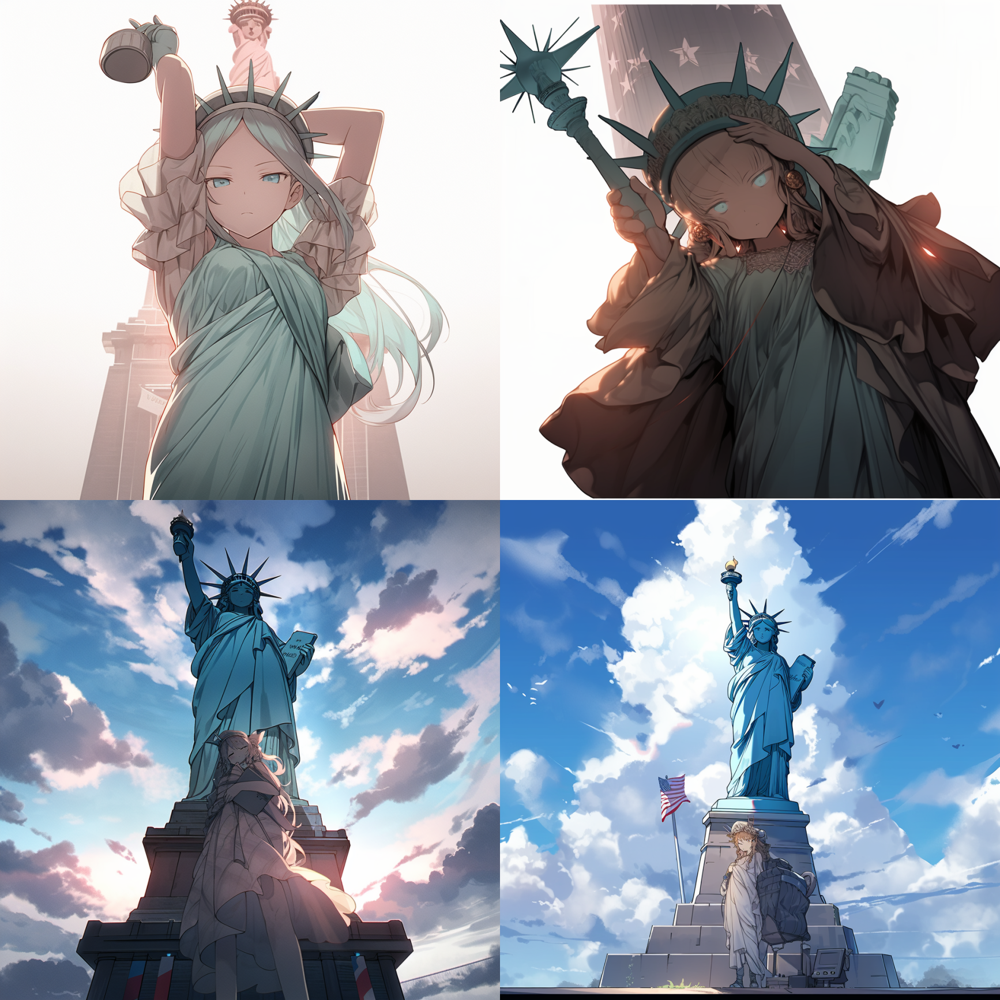
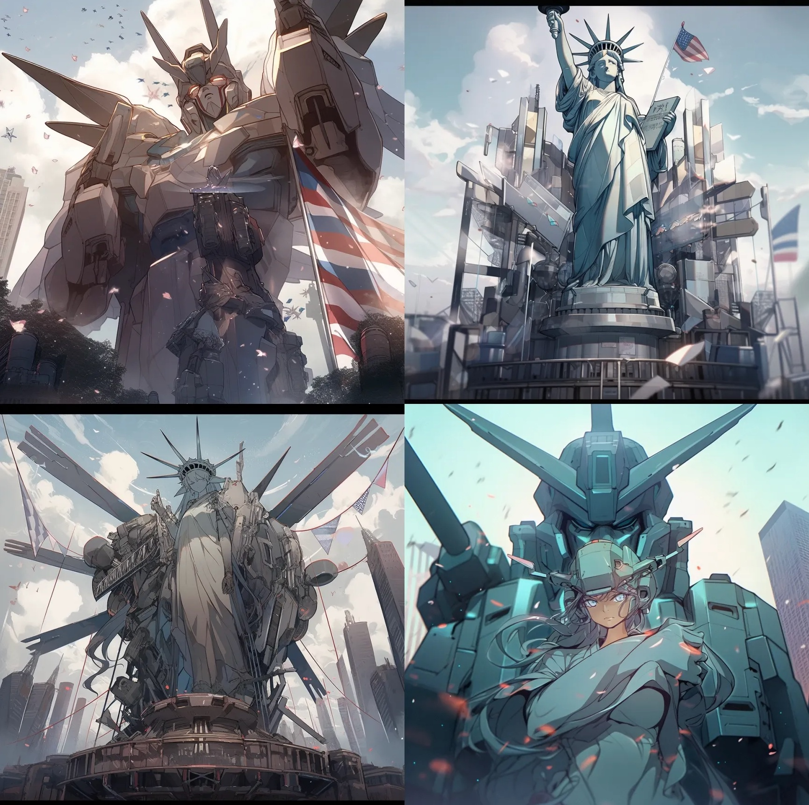
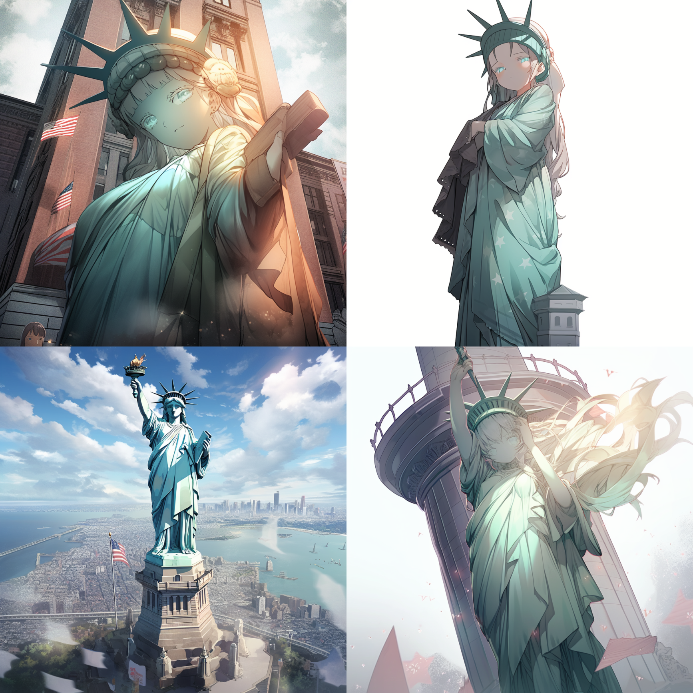

# 👺 Anime List

> For length I won't cover many styles here, but I'll share more on my [Twitter](https://twitter.com/hellojimmywong) - follow me there for updates.

| 
**Photo**
               | **Name**                   | **Description**                                                                                                                                        |
| ------------------------------------------------------ | -------------------------- | ------------------------------------------------------------------------------------------------------------------------------------------------------ |
|   | Chibi Anime Style          | Chibi anime features miniature, cute, caricatured characters with oversized heads and simplified bodies/expressions for dynamic effects.               |
|   | Gakuen Anime Style         | Common style featuring high school life - student council, cultural festivals, romance, friendship, competition.                                       |
|   | Gekiga Anime Style         | Sober, serious style tackling adult themes like social issues and philosophy. Uses monochrome palette, realistic expressions/behaviors.                |
|   | J Horror Anime Style       | Horror genre dealing with supernatural themes like ghosts, spirits, monsters.                                                                          |
|   | Jidaimono Anime Style      | Period dramas depicting Japanese history/culture - war, family conflicts, ninja, bushido, myths. Uses distinct Japanese art styles.                    |
|   | Kawaii Anime Style         | Very cute, kawaii style featuring bright colors, rough outlines, exaggerated facial expressions.                                                       |
|  | Mecha Anime Style          | Robot-focused style depicting giant machines, mech battles, armored suits. Uses sci-fi, future settings, large-scale fights, dynamic battle scenes.    |
|   | Realistic Anime Style      | Realist style with more true-to-life characters and storylines. More nuanced expressions, environments, emotive depth.                                 |
|   | Semi-Realistic Anime Style | In-between realistic and anime styles - more realism but still stylized anime elements. Realistic stories but some anime-style rendering.              |
|   | Shoji Anime Style          | Comedic style per manga artist Shotaro Ishinomori focused on individuals/small groups. Bright, harmonic scenes, exaggerated expressions, simple plots. |
|   | Kemonomimi Anime Style     | Characters with animal ears/tails. Human or humanoid with various animal features, related to girls' manga, boys' manga styles.                        |
