# 💡 Lighting List

这个 List 里的内容，我会在我的[小红书账号](https://www.xiaohongshu.com/user/profile/6073d38d00000000010068a6?xhsshare=CopyLink&appuid=6073d38d00000000010068a6&apptime=1679646639)上同步更新。感兴趣的朋友可以去关注下。

| 
**照片**
 | **名称**                   | **介绍**                                                                                                                       | **适合场景**                                                                                                                                       |
| ------ | ------------------------ | ---------------------------------------------------------------------------------------------------------------------------- | -------------------------------------------------------------------------------------------------------- |
|      | Mood Lighting            | 氛围灯。主要是通过在特定的环境中改变灯光的颜色和亮度等参数来创造一种特定的氛围，以营造舒适、浪漫、放松等感觉。从技术实现上看，Mood lighting则着重于灯光的颜色和亮度控制，注重创造强烈的视觉效果。                  | Mood lighting通常用于室内设计、酒店、餐厅及居家装饰等领域，旨在创造出一种特定的气氛和体验。                                                                                           |
|  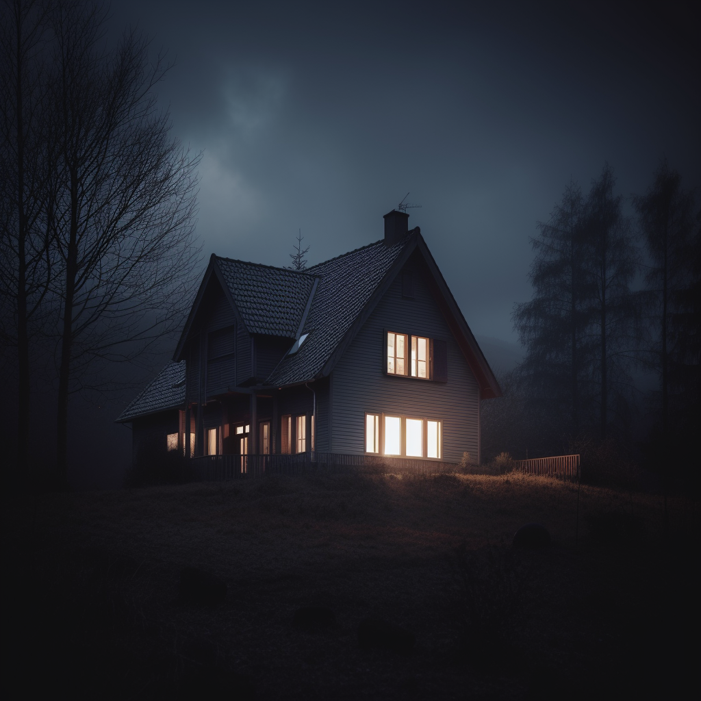     | Moody Lighting           | 情绪灯。它更强调在情感表达和为故事情节服务方面的应用，设计的目的是要把灯光与剧情完美结合起来，以展现角色的个性和情感世界。从技术实现上看，Moody lighting通常采用低亮度和大比例遮挡阴影，强调暗部的扫描，以增加画面的纹理和层次感。 | Moody lighting通常用于影视制作、游戏界面、舞台表演等领域，设计的目的是为了增加故事情节的戏剧效果。                                                                                       |
|  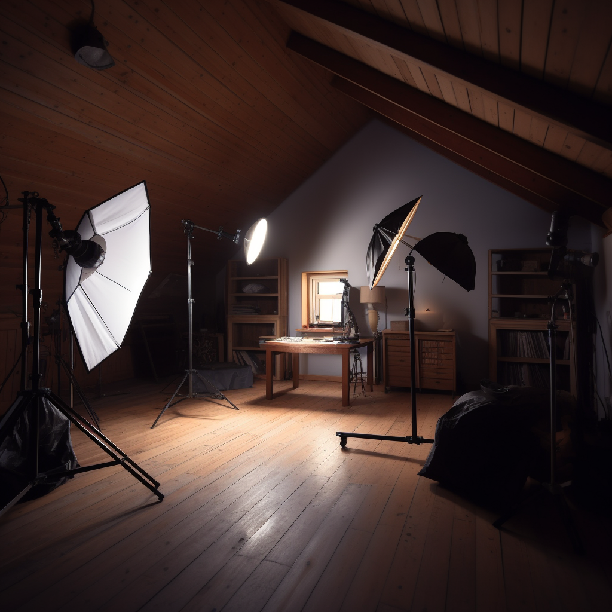      | Studio Lighting          | 工作室灯光。是一种专门用于摄影工作室、电视和电影等领域的照明设计。它将光源和灯具放置在一个专用的摄影工作室中，通过精细的照明来创造出各种不同的氛围和场景效果，以满足各种不同的拍摄需求。                                 | Studio lighting 主要应用于商业摄影、时装摄影、艺术摄影、人像摄影、广告拍摄、电影和电视制作等领域，目的是通过精细的照明设计来突出主体的特点，达到最佳的拍摄效果。                                                       |
|  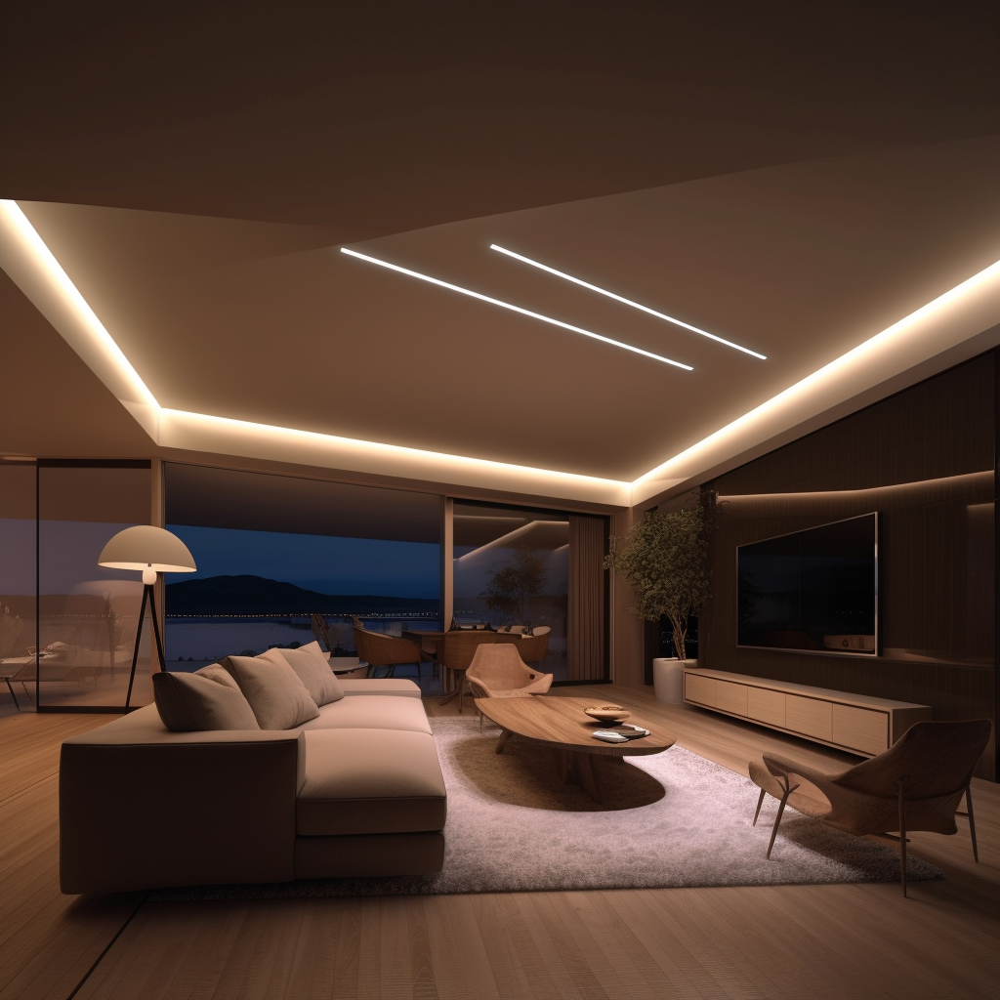      | Cove Lighting            | 壁角灯。是一种常用的室内照明设计，其灯具通常安装在墙壁或吊顶壁橱之间的壁角（即“壁橱”)中，从而营造出舒适、柔和、光滑的环境照明效果。                                                          | 这种照明技术可以为房间提供均匀的光线，同时提高房间的美感和时尚度。                                                                                                              |
|  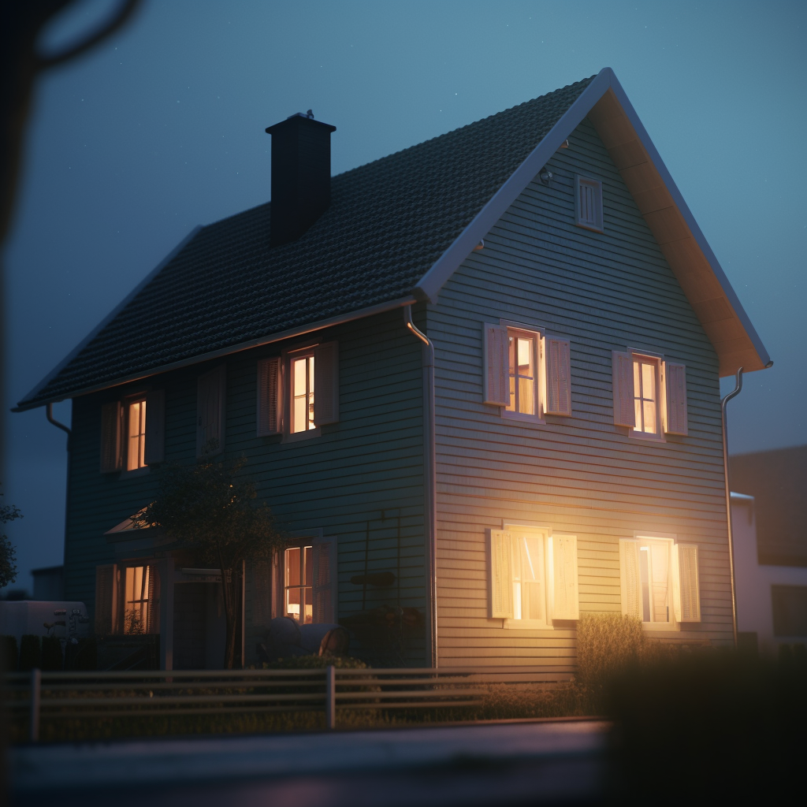      | Soft Lighting            | 柔和照明。是指通过使用柔和、漫射的光线来创造出柔和、温暖的氛围效果。柔和的光线通常是通过使用的漫射灯具来实现的，较为常见的是壁灯、台灯、阅读灯等。                                                    | 柔和照明效果可以降低照度，减轻视觉疲劳，创造出舒适的氛围和感觉。                                                                                                               |
|  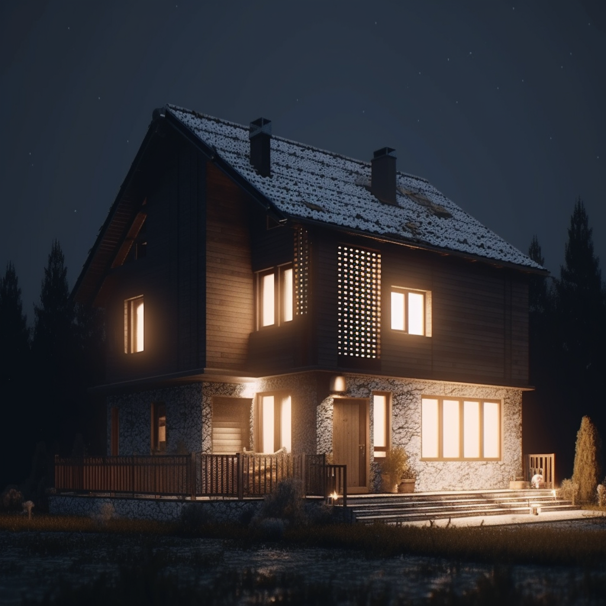      | Hard Lighting            | 硬朗照明。是指通过使用聚光灯、筒灯等灯具来聚焦到一个特定的区域中，其光线是相对集中而直接的。                                                                               | 创造出刚硬、明亮的照明效果。硬朗照明常常用于展示场合，如美术馆、商场等环境，以突出展品或商品的特点和质感。                                                                                          |
|  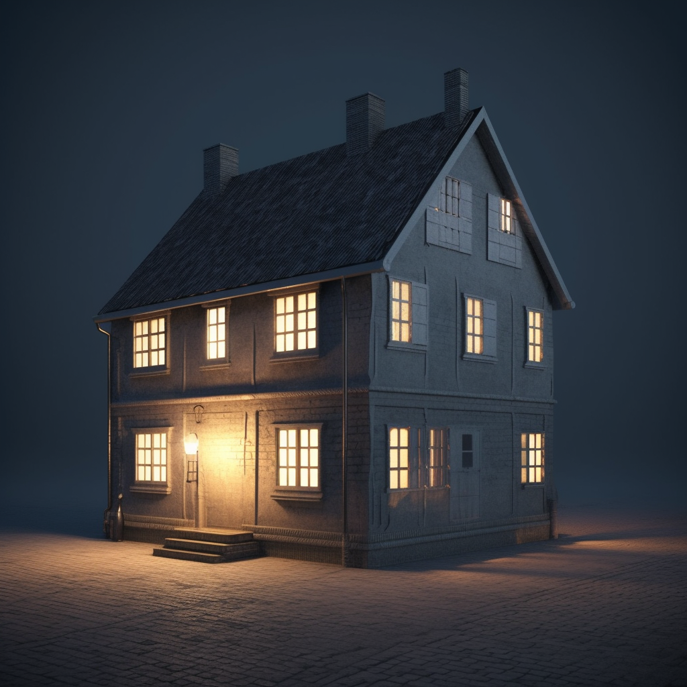      | Volumetric Lighting      | 体积光。是一种创造逼真渲染效果的照明效果技术。它通过在某些场景中添加灯光和各种视觉效果，如扩散、雾、粒子、阴影等，在照明场景中模拟空气中的粒子和尘埃微粒的现象，从而创造出动态、逼真、增强立体感和体积感的照明效果。                   | 适用于多种场景设计中，如电影、电视、视频游戏、动画等领域。它可以让场景更加逼真、立体，增加场景的紧张度和视觉层次感，并带来更具有表现力的视觉效果。                                                                      |
|  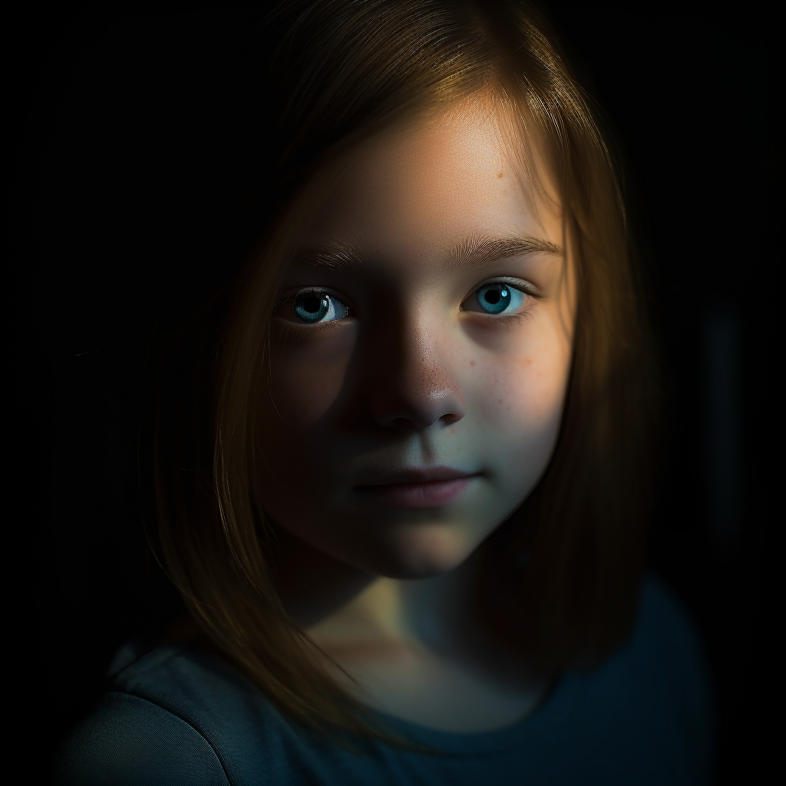      | Low-Key Lighting         | 低键照明。指的是一种特殊的照明效果，该效果通常通过强烈的侧光或背光和阴影来创造高对比度的画面效果。低键照明的特点是明暗分明、阴影浓重、暗调占主导地位，常常构建一种紧张、神秘或黑暗的氛围。                                | 低键照明广泛应用于电影、电视、摄影等领域中，常常用来表现悬疑、恐怖、犯罪等要素。                                                                                                       |
|        | High-Key Lighting        | 高键照明。这种照明效果通过使用明亮、均匀的光线来避免明暗对比并压低阴影的出现。这种照明效果特点是亮度高、细节丰富，适用于需要传递愉悦、轻松和开心氛围的场景和环境。                                            | 高键照明通常用于广告、情感电影、电视剧等中。                                                                                                                         |
|  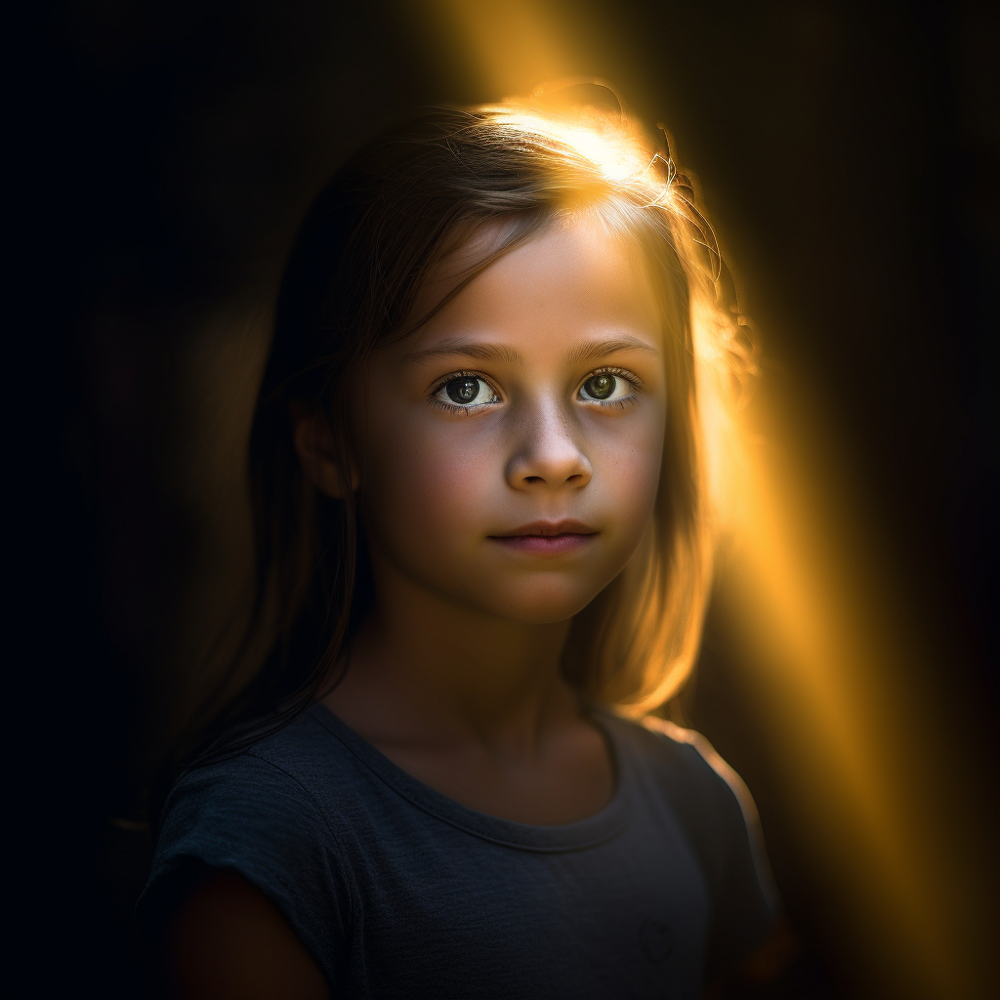      | Epic Light               | 史诗光线。是一种创建极富戏剧性、威严感和视觉效果的照明技术，它可以在场景中添加非常亮烈、盛大、壮观的光线，以吸引观众注意力并增加场景的震撼力。                                                      | Epic Light通常用于影视制作、游戏开发、演出等领域中，以营造出一种崇高、壮丽、宏伟的氛围，可以使观众在看到这些效果时，感到非常震撼和难以忘怀。史诗光线的特点是亮度较高、颜色鲜艳，通常用于表现重要的剧情点，如武器的激光、宇宙战争中的太阳和星星、幻想电影和电子游戏中的神秘光芒等。 |
|  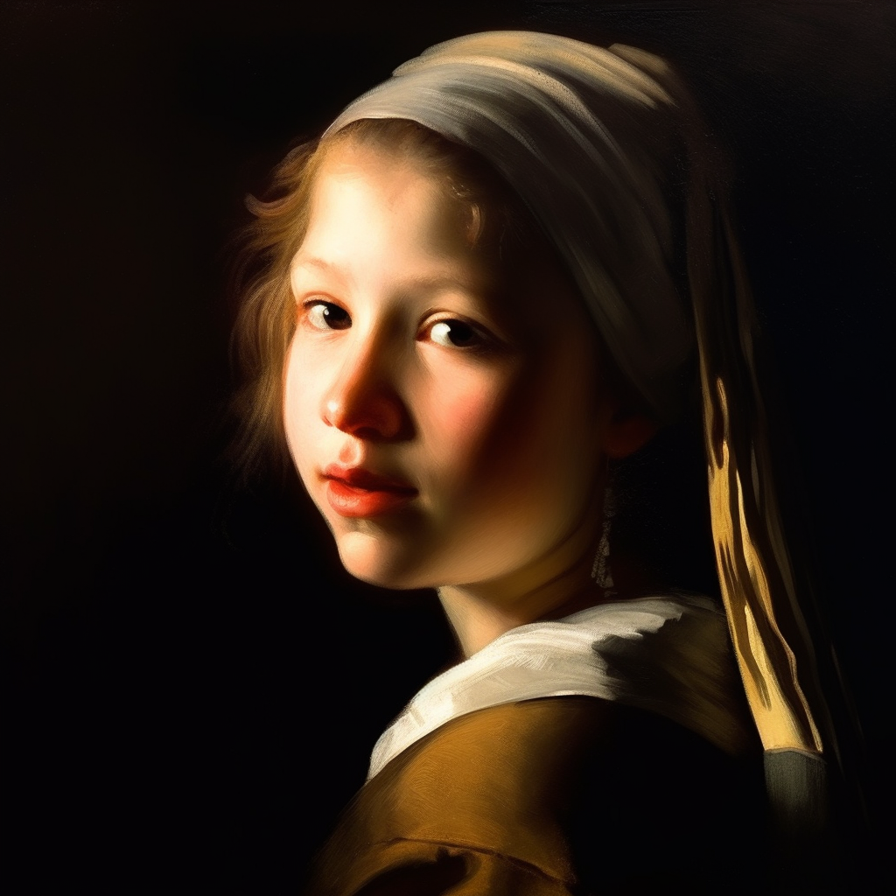      | Rembrandt Lighting       | 伦勃朗特效是一种起源于荷兰画家伦勃朗的照明效果，其主要特点是在人物脸部形成一个菱形的明暗分界线，嘴巴和下巴的一侧用阴影覆盖，人物的另一侧则被亮光照亮。                                                  | 能营造出一种柔和而神秘的效果。                                                                                                                                |
|  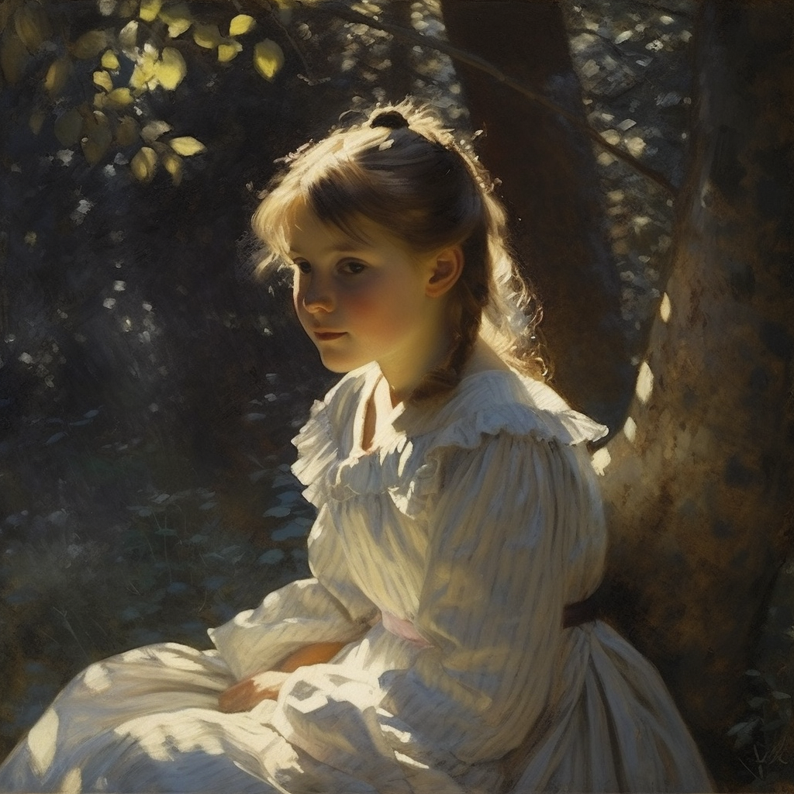      | Contre-Jour              | 逆光照明。指的是摄影师将光源放置在被摄物体的背后，令照射效果在镜头前面产生，形成被摄体轮廓明显的负片形态。                                                                        | 于光源位置造成的暗摄影整体的虚化，高对比度和鲜明的轮廓线可以带来文艺和抽象的氛围。                                                                                                      |
|   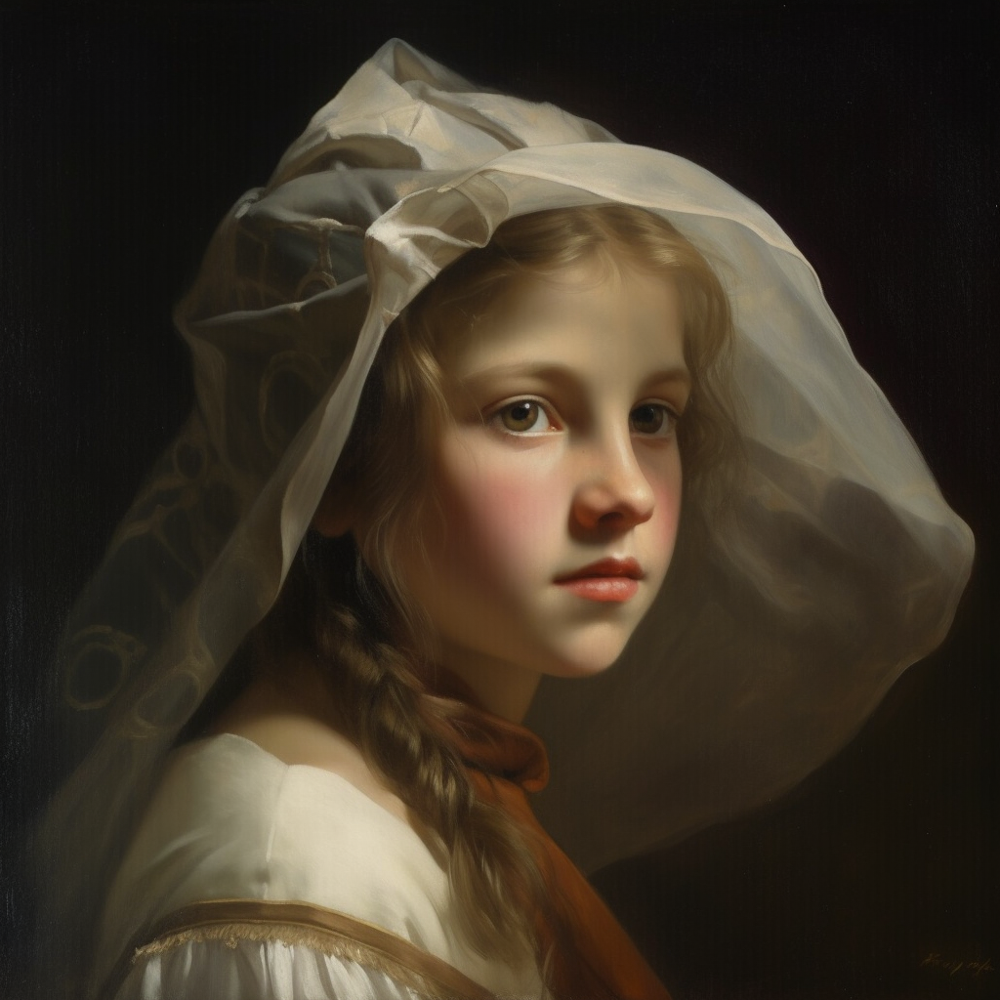     | Veiling Flare            | 透镜毛玻璃。指当光线从透镜或镜头穿过时，透过玻璃或镜头的反光或散射使得图像出现散射光线或最终成像看起来失真的现象。                                                                    |                                                                                                                                                |
|        | Crepuscular Rays         | 黎明、黄昏光线。也称为太阳光柱，是由日光在云层或尘埃中被反射形成的光线束。因为只有在日出和日落时才有足够的光线穿过云层或照射到恰当的夹角，所以Crepuscular Rays通常只出现在日出和日落时刻。                        | Crepuscular Rays通常会在云层上形成明显的束状光线，给人以美丽的感觉。                                                                                                     |
|  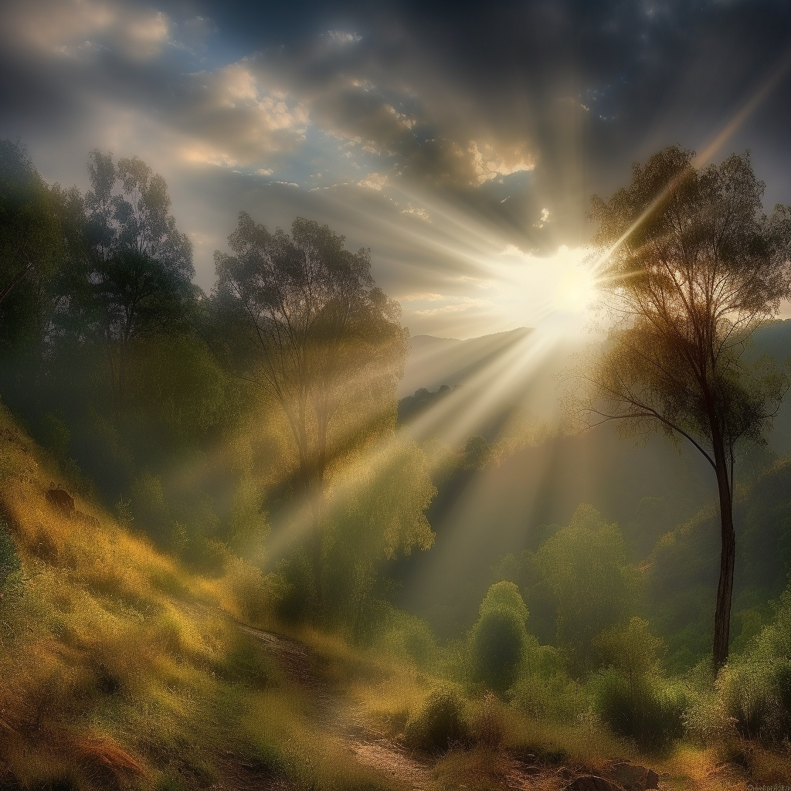      | Rays of Shimmering Light | 闪烁光线。是指在光线散射和折射时出现的光线折射现象。在某些特定的环境下，光线经过不同密度和温度不同的气氛，会出现一种光线折射、散射的效果，从而形成闪烁光束效果。                                             |                                                                                                                                                |
|   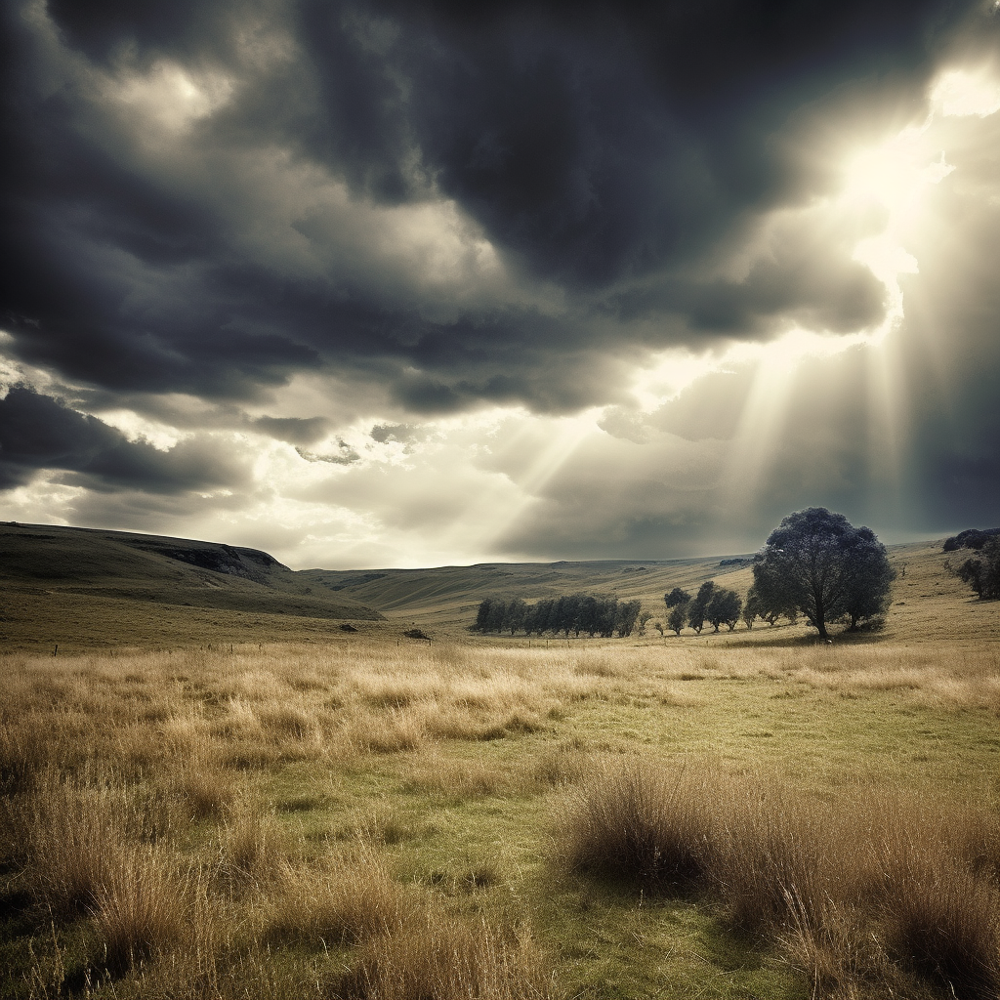     | Godrays                  | 神光。是一种由光线穿过云朵、树枝或其他障碍物时，形成的亮光条纹效果。Godrays通常在光线较强的时分出现，将光线分割成条纹状，形成一种梦幻般的效果，也被称为 "crepuscular rays" 的一种。                      |                                                                                                                                                |
