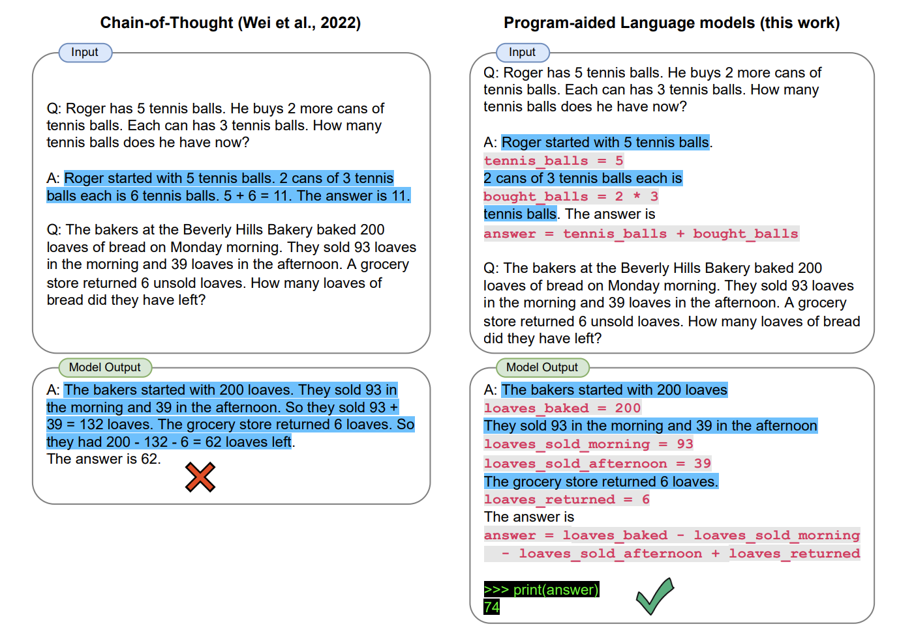

<head>
  <script defer="defer" src="https://embed.trydyno.com/embedder.js"></script>
  <link href="https://embed.trydyno.com/embedder.css" rel="stylesheet" />
</head>

PAL Models，全称为 Program-Aided Language Models。需要各位注意，这个方法，真的非常高级，甚至我觉得有点 Hack，而且经过我的多次测试，我觉得以 ChatGPT 目前的能力，已经不再需要使用这个方法。

但我在很多 PE 的教程里都有看到这个方法，所以我这里就简单介绍一下，这个方法来自于 2022 年，Luyu Gao [等人的研究](https://arxiv.org/pdf/2211.10435.pdf)，根据他们的研究，在 LLM 模型中，即使使用了前面提到的 Chain of Thought 的方法，也未必能拿到答案，论文中使用的 prompt 是这样的：

```other
Q: Roger has 5 tennis balls. He buys 2 more cans of
tennis balls. Each can has 3 tennis balls. How many
tennis balls does he have now?
A: Roger started with 5 tennis balls. 2 cans of 3 tennis
balls each is 6 tennis balls. 5 + 6 = 11. The answer is 11.

Q: The bakers at the Beverly Hills Bakery baked 200
loaves of bread on Monday morning. They sold 93 loaves
in the morning and 39 loaves in the afternoon. A grocery
store returned 6 unsold loaves. How many loaves of
bread did they have left?
```

论文里提到，当年他们的模型的 Output 是这样的：

```other
A: The bakers started with 200 loaves. They sold 93 in
the morning and 39 in the afternoon. So they sold 93 +
39 = 132 loaves. The grocery store returned 6 loaves. So
they had 200 - 132 - 6 = 62 loaves left. 
The answer is 62.
```

如果你现在将这个 prompt 输入到最新的 ChatGPT 答案已经是正确的：

```other
A: The bakers baked 200 loaves of bread. They sold 93 + 39 = 132 loaves. After the grocery store returned 6 unsold loaves, the bakery had 200 - 132 + 6 = 74 loaves of bread left. The answer is 74.
```

当年 Luyu Gao 的解决方法是在 prompt 里引入代码，并引导模型使用代码来运算和思考，最后答案就是正确的：



