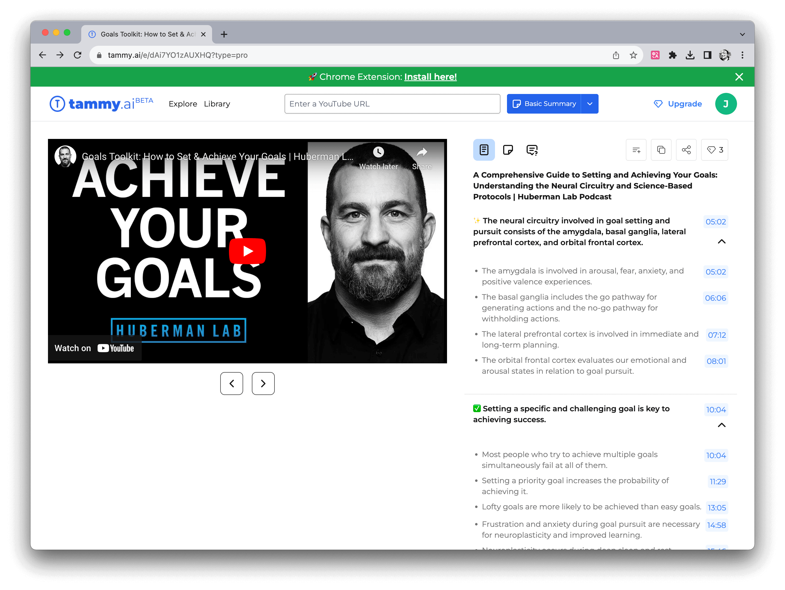
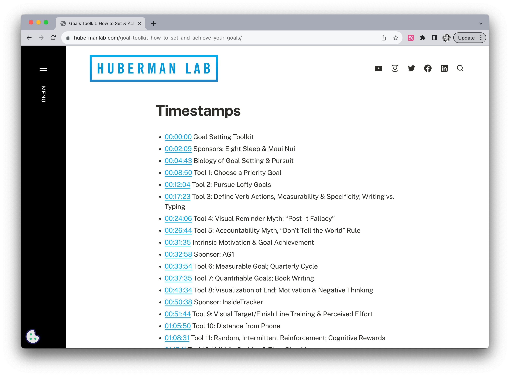

# 使用 AI 工具听播客和看视频

作者：JimmyWong

如果你有任何好的想法，欢迎加入我们的 [Discord 频道](https://discord.gg/B7Z7wjuUPg) 进行分享 😁

## 问题

因为兴趣的原因，我常常会听一些英文播客和看一些英文视频，但有些播客或视频内容比较专业，所以听起来总是有些吃力，尤其是一些口音比较重的播客，经常会遇到听不懂的情况。这样就会导致我需要反复听，或者是查字典，这样就会浪费很多时间。

我之前的解决方案是下载播客或视频的字幕，然后边听边看，遇到不懂的地方还会用翻译软件翻译。但这样做效率比较低。

今年，随着 ChatGPT 的出现，越来越多与之相关的 AI 工具出现，其中一个比较多人关注的就是 AI 总结播客和视频。我也尝试了很多工具，试验了很久，最终总结出来以下三个能显著提高 AI 总结的准确率的方法，希望能帮助到大家。

## 解决方案

### 1. 挑选适合 AI 总结的播客或视频

首先，根据我的经验，并不是所有播客或视频都适合 AI 总结或翻译，因为 AI 并不知道什么是重点，对于一些闲聊访谈类的播客，AI 总结的效果就非常不好。目前实验下来，我认为**「主题较为明确的播客或视频」**比较适合 AI 总结。

以我常听的播客 Huberman Lab 为例，他的播客主要有两种，一种是 Dr Andrew Huberman 一个人讲解，另一种是他和其他人的访谈。其中，前者的主题比较明确，比如下图中第一期播客的主题是「如何达成目标」，这样的播客就比较适合 AI 总结。而后者的主题虽然也比较明确，但因为访谈的时候还是会有很多闲聊，所以 AI 总结的效果就不太好了。

再举几个比较适合 AI 总结的播客或视频的例子：

- Ted 视频
- 手机或者数码产品分享视频
- 新闻或者时事类播客或视频

### 2. 分段总结

如果你能够找到适合 AI 总结的播客或视频，那么接下来就是如何使用 AI 总结了。目前主流的方法有两种，第一种是下载播客或视频的字幕，然后将字幕输入到 AI 工具中进行总结。第二种是直接将播客或视频的 URL 输入到 AI 工具中进行总结。

第一种方法我一般会用 [Claude](https://claude.ai/)，因为它的最大 Token 比较大，比较适合长播客或视频。但它的缺点是，如果播客或视频比较长，那么它会将整个播客或视频的内容作为一个整体进行总结，这样的话，总结的内容会丢失比较多。不过如果你的要总结的视频比较短，且内容很聚焦，比如一些 Ted 演讲视频。那么用 [Claude](https://claude.ai/) 总结就是个不错的选择。

第二种方法则是不需要下载字幕，直接将播客或视频的 URL 输入到 AI 工具中进行总结。这样的话，AI 工具会自动将播客或视频分段，然后对每个段落进行总结。这样的话，总结的内容会更加准确。比如 [TammyAI](https://tammy.ai/)：

它的特点是会根据段落进行总结，所以总结的内容会比较准确。如果你看 Bilibili 比较多，也可以试试[BibiGPT](https://bibigpt.co/):

不过这种分段式的总结工具还是有可能会 miss 掉一些部分。所以我还会使用第三种方法。

### 3. 结合 show-note 进行二次询问

如果你使用的 AI 总结工具是分段式的，那么你可以结合 show-note 进行二次询问。比如前面提到的 Huberman Lab 的「如何达成目标」这期播客，它的 show-note 里有写这期播客一共讲了 14 个能帮助你达成目标的工具，并且还将每个工具的名字也都列了出来，比如其中一个 tool 是这样的：

> Tool 5: Accountability Myth, “Don’t Tell the World” Rule

那你就可以问 AI 工具：播客里提到的 Don’t Tell the World Rule 是指什么？

基于这个方法，我将听播客和看视频的效率提高了 2-3 倍。

不过需要注意的是：即使使用二次询问，AI 总结的内容也不一定是 100% 准确的，所以如果可以的话，可以去看看原字幕。

