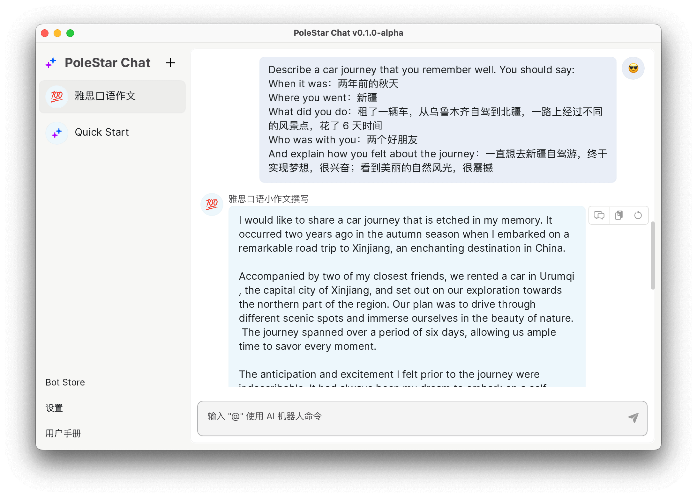
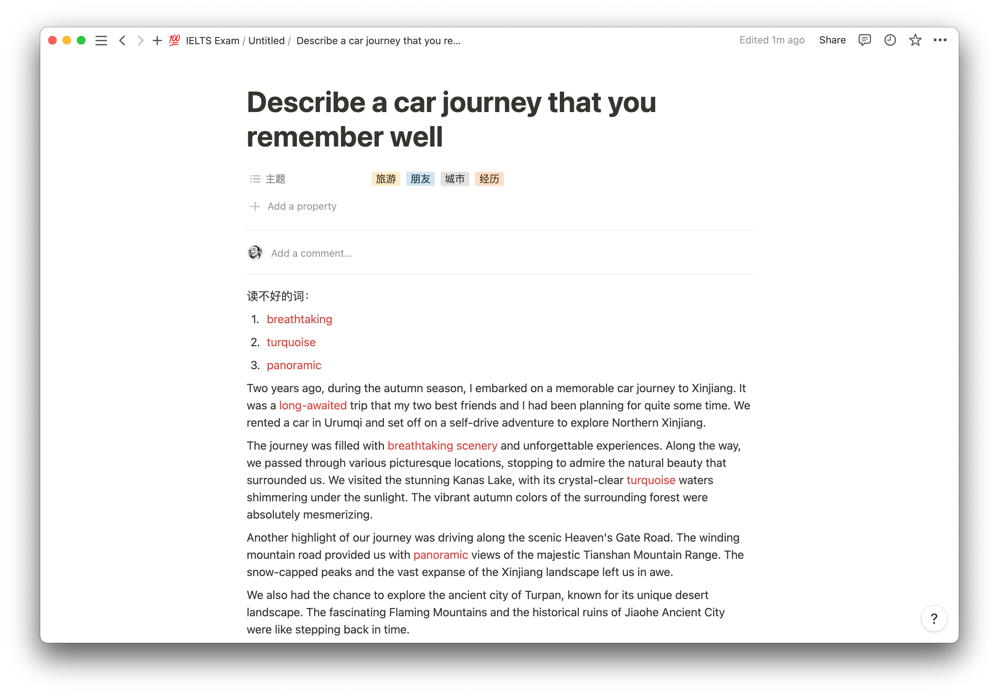
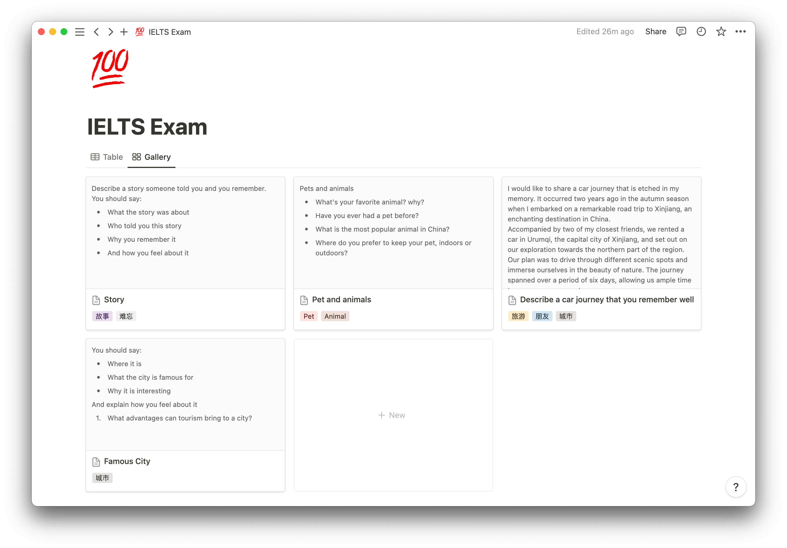
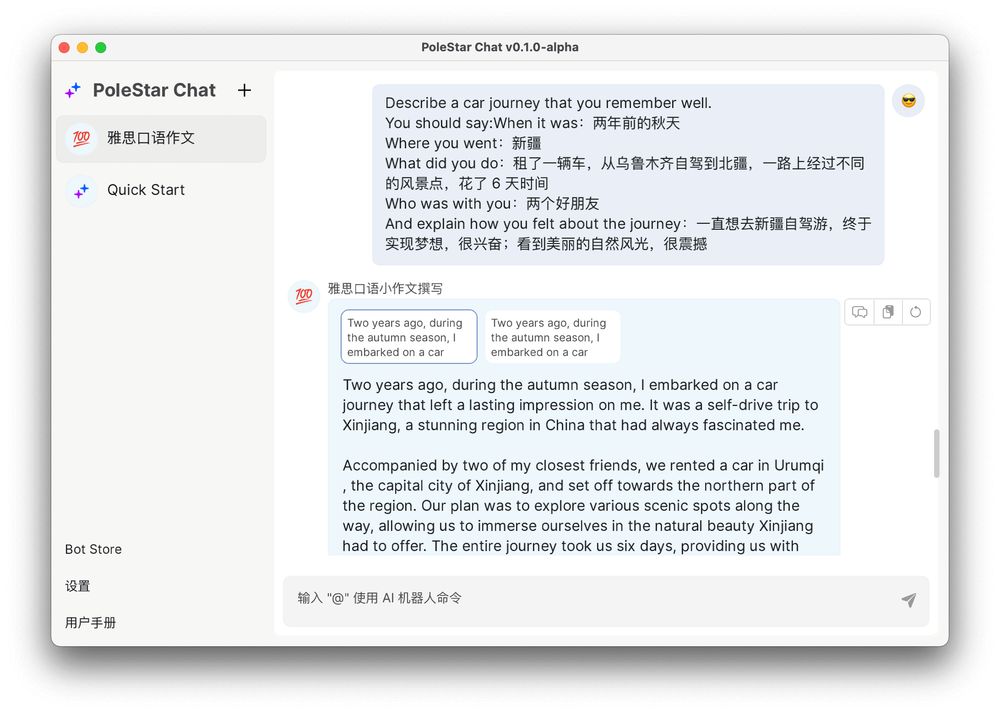
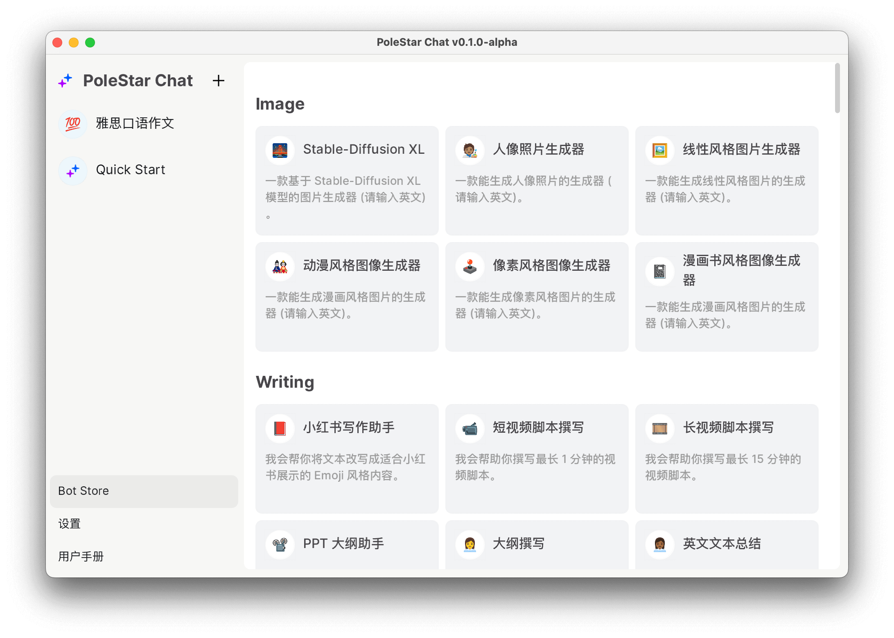

# 使用 AI 备考雅思口语考试

作者：JimmyWong

如果你也有不错的想法，欢迎加入我们的 [Discord 频道](https://discord.gg/B7Z7wjuUPg)进行分享 😁

## 问题

雅思口语考试分成以下几个部分：

- Part 1：考官会让考生进行自我介绍，并简单问下考生的一些个人问题，例如身份、兴趣爱好等。
- Part 2：考官会交给考生一个答题任务卡、铅笔和草稿纸做笔记。答题任务卡上会给出一个话题，和一些关键问题。考生需要在 1 分钟内准备，然后在 2 分钟内根据任务卡上的要求进行陈述。
- Part 3：Q&A，考官会就 Part 2 中的话题进行深入提问，考生需要回答考官的问题。

在口语考试中 Part 2 有点像口语命题作文，以下是一个真实考题：

> Describe a car journey that you remember well. You should say:
> - When it was：
> - Where you went：
> - What did you do：
> - Who was with you：
> - And explain how you felt about the journey：

因为 Part2 有题库，所以一般考生都会提前准备。做法一般是在考试前先根据题目要求，手写作文，然后进行记忆或背诵，这样在考试中就能很快速地完成陈述。但是，考生在准备的时候，往往会遇到以下问题：
1. 题目很多，需要准备很多篇内容。
2. 自己写的内容不够好，需要有人帮忙改正。

所以不少考生会选择付费购买一些模板，这些模板一般都是经由专门的老师编写（甚至有一些是请外教写的），内容质量相对比较高，但是：

1. 价格一般比较贵。
2. 因为这种服务一般会服务很多学生，所以也无法保证完全不重复的情况。
3. 无法个性化定制内容，记忆起来会比较困难（当然如果你愿意付更多的钱，也有提供定制的服务）。

## 初阶方案

最近我了解到有一位朋友使用 AI 工具辅助备考雅思口语。根据我多名朋友的测试，相对于自己写的内容，**能够提高 0.5-1.0 分的分数**，而且还能节省很多准备时间。另外，你也不需要再记录花钱请别人帮你写。

我也对这个方案进行了尝试，发现效果还不错，所以在这里分享给大家。

还是以上面那个题目为例，我们可以先用中文写出自己的答案（最好用自己的真实经历，这样记忆或背诵起来会更简单）：

> Describe a car journey that you remember well. You should say:
> - When it was：两年前的秋天
> - Where you went：新疆
> - What did you do：租了一辆车，从乌鲁木齐自驾到北疆，一路上经过不同的风景点，花了 6 天时间
> - Who was with you：两个好朋友
> - And explain how you felt about the journey：一直想去新疆自驾游，终于实现梦想，很兴奋；看到美丽的自然风光，很震撼

然后将题目和写的答案输入到 AI 工具中，就可以得到一篇范文了：



然后你可以根据自己的实际情况，对生成的内容进行修改，比如删除掉一些内容（因为口语时间有限，没法说那么长），或者是增加一些自己常用的口语高分词。另外根据习惯，你还可以将不熟悉的词标注出来：



## 进阶方案

因为题库里的题目非常多，如果每道题目都写一篇，那记忆量就太大了。所以还有一个进阶的方案，首先你可以在笔记工具里罗列所有题目，并对题目进行分类，比如这样：



完成分类后，你可以将类似的题目进行归类，比如上图中，最后两个题目是有相关性的，一个是汽车旅行，一个是城市。那你准备的话题就可以是开车去某个著名城市旅行。

然后你可以将融合后的题目输入到 AI 工具中，然后再根据自己的实际情况进行修改。这样原来需要准备几十篇口语作文，就变成只需要准备几篇，记忆或背诵量就会大大减少。

另外，目前还有一个问题，现在相对来说比较难控制 AI 生成内容的字符数，所以你需要根据自己的实际情况，对生成的内容进行删减，这样才能在考试中更好地控制时间。还有就是可以让 AI 多生成几篇，然后进行对比，选出最好的一篇。

为了让大家方便对比结果，我们的产品 PoleStar Chat 点击 retry 后，支持多 tab 显示，这样你就可以很方便地进行对比：




## Prompt

我的 prompt 比较简单，主要的变量是分数和字符数，你可以根据自己的需求进行更改。不过字符数控制很不准确，我试了几种方法都不是很理想，后续有好的方法我会再迭代一下。

```
请撰写一个能在雅思英语口语考试中获得 7 分的英语口语稿。
注意长度约为 200~220 个英文单词。要求在文稿里使用雅思英语口语 7 分单词。题目和要求如下：
```

你也可以下载我们的应用直接使用这个 Prompt，目前我们的应用预制了多达 100 多种 Prompt 模版：



最后也欢迎各位加入我们的 [Discord 频道](https://discord.gg/B7Z7wjuUPg)，分享你写的 Prompt。