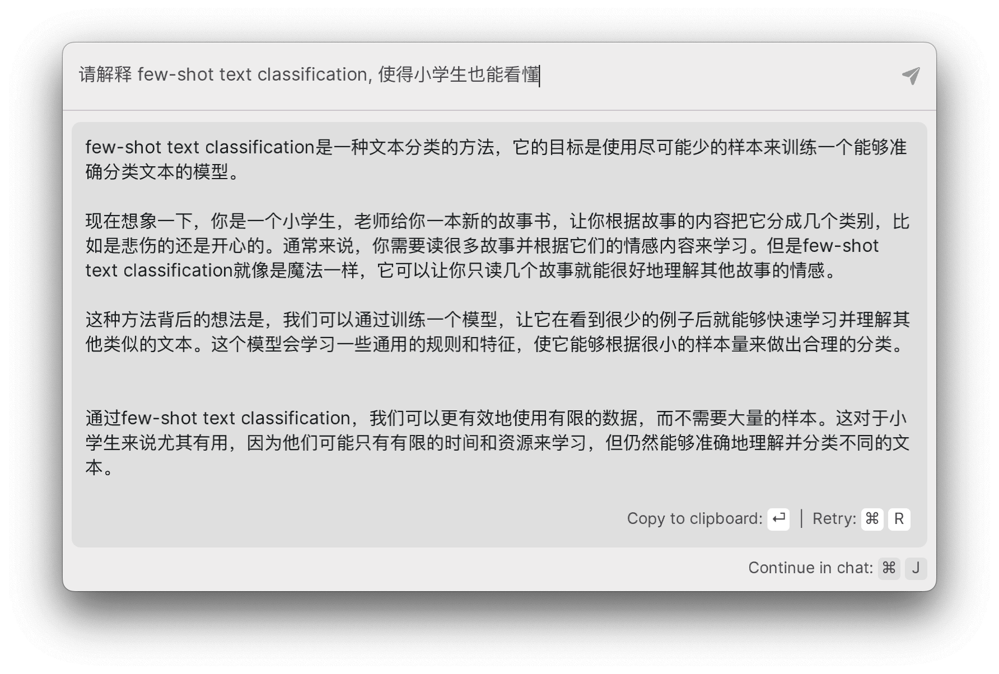

import ReactPlayer from 'react-player/youtube'

# 使用 AI 辅助阅读

作者：JimmyWong

如果你也有不错的想法，欢迎加入我们的 [Discord 频道](https://discord.gg/B7Z7wjuUPg)进行分享 😁

## 问题

最近我一直保持阅读论文的习惯，有朋友私信问我是如何阅读论文的，我觉得这个问题很有意思，所以在这里分享给大家。

阅读论文的时候，我们经常会遇到以下问题：

- 论文内容比较专业，有些词汇不太熟悉，如果是英文论文，遇到这些专业词汇还需要查阅词典。
- 论文写得相对晦涩，看不懂。 
- 没有时间看那么多的论文。

我的做法是，先用 AI 工具辅助阅读论文，然后再撰写笔记。另外，这个方法并不仅仅适用于阅读论文，对于阅读其他书籍、文章也是适用的。

## 方法

首先，我一般会用 [AI 论文阅读速递](https://briefgpt.xyz/feed/top) 阅读论文，这个网站会自动从 arXiv 上爬取最新的论文，并用 AI 对论文的标题进行了翻译，同时还用 AI 进行了总结，看一眼中文标题，以及总结你就可以快速了解论文的主要内容。


### 翻译

遇到感兴趣的内容，我就会去看论文的原文，遇到看不懂的内容，我一般都会用 AI 进行翻译。因为我也开发了一款 AI 工具，所以我一般都会用自己的产品 —— [PoleStar Chat](https://github.com/thinkingjimmy/PoleStarChat/releases)。
操作挺简单的，首先框选你需要翻译的内容，然后点击快捷键 cmd + c + c，接着就会唤起 PoleStar 的快捷输入框，同时你框选的内容也会出现在输入框内。
最后选择对应的翻译 bot，点击回车，就可以看到 AI 翻译的结果了。全程无需输入任何额外的 prompt，非常方便快捷：

<ReactPlayer width = '100%' playing controls url='https://youtu.be/axtY3pkYHIQ' />

[查看视频](https://youtu.be/axtY3pkYHIQ)

### 解释

另外，除了翻译之外，还有一个我比较常用的是「解释」，比如遇到我不懂的专业词汇，亦或者比价难懂的句子，我就会用 AI 用中文进行解释。
比如这篇论文的结尾比较难懂，我就会让 AI 尝试以中文进行解释，同时我还会要求 AI 换成一种小学生都能懂的表述，复述一遍内容，像这样：



### 总结

对于最后一个「没有时间看」的问题，很多朋友的想法是用 AI 对论文或者文章进行总结，但正如我之前在[《AI Summary 会取代人工 Summary 吗？》](../../../insight/my-insight/will-AI-summary-replace-manual-summary.md)一文中提到：

- AI 并不知道什么是重点，只阅读它总结的内容，你有可能会丢失一些重要信息。
- 在没有完整阅读全篇论文的情况下，你没法确定 AI 生成的总结是准确的

所以我不推荐大家使用 AI 总结论文。但这并不意味着没法通过 AI 加快你的阅读速度。

首先对于论文来说，我建议：
- 直接翻译 Abstract，这样可以快速了解论文的主要内容，如果你对论文感兴趣，再决定是否阅读全文。
- 然后再让 AI 翻译论文的最后一部分 Conclusions，这样可以快速了解论文的结论，我一般看完结论就会记笔记，如果看不懂结果，或者好奇研究过程才会去看论文的中间部分。

可能各位看完我的方法，会觉得我过于功利，或者囫囵吞枣。

坦率说来，我一开始也觉得这种方式有点不好，不够深入。但后来我发现：
- 靠 AI 论文是很难学深入的，要想了解细节还是得系统地看书，或者教程。
- AI 相关的发展非常快，论文的作用是让我保持信息的敏感性，并从中发现潜在的机会，而不是深入地了解其技术（况且论文里提到的新技术，也不一定能马上用到）。

所以，不用过分纠结深度问题。而是让 AI 充当一个过滤器，帮你过滤掉你不感兴趣的东西。况且其实有很多论文都不值得读，没必要纠结和焦虑。


## Prompt

翻译：

```
我要求你充当汉语翻译、拼写纠正和改进者。我会用任何语言与你交流，你需识别语言并将其翻译成汉语，并提供纠正和改进后的版本。
请注意，你只能回复纠正和改进，不要写解释。以下是需要翻译的内容：
```

解释：

这个可以根据自己的需求进行调整，我一般都会用「让小学生也能看懂」

```
请解释 XXX ，使得小学生也能看懂
```