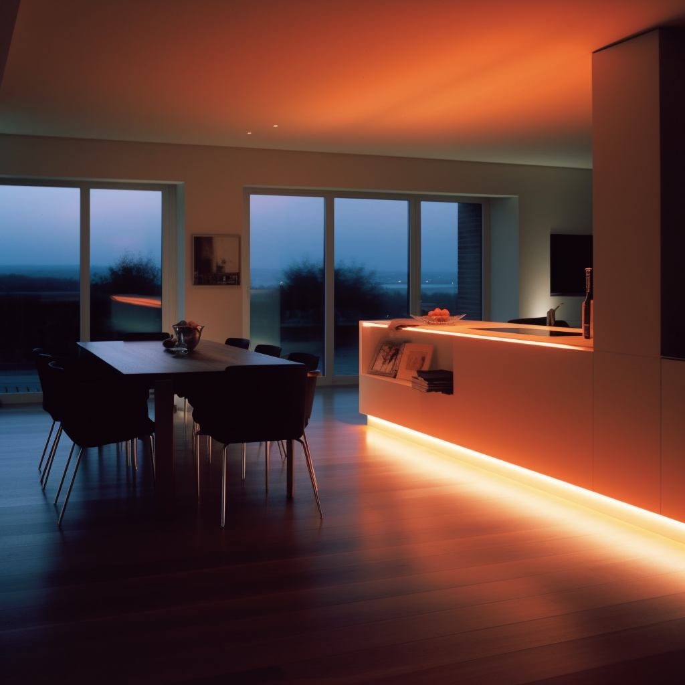
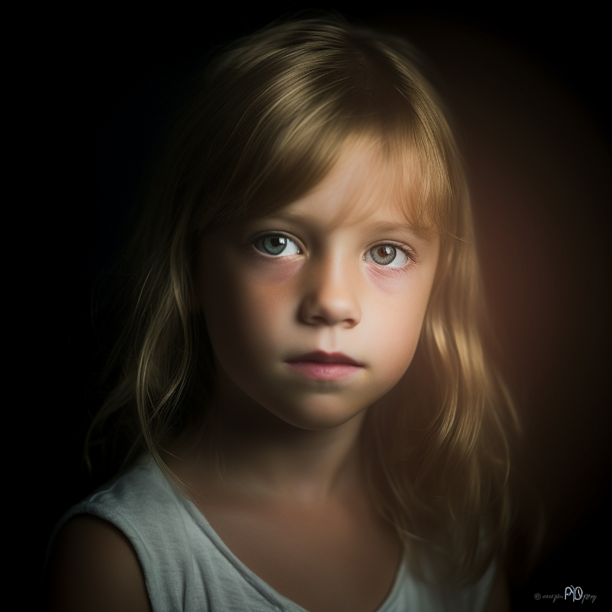
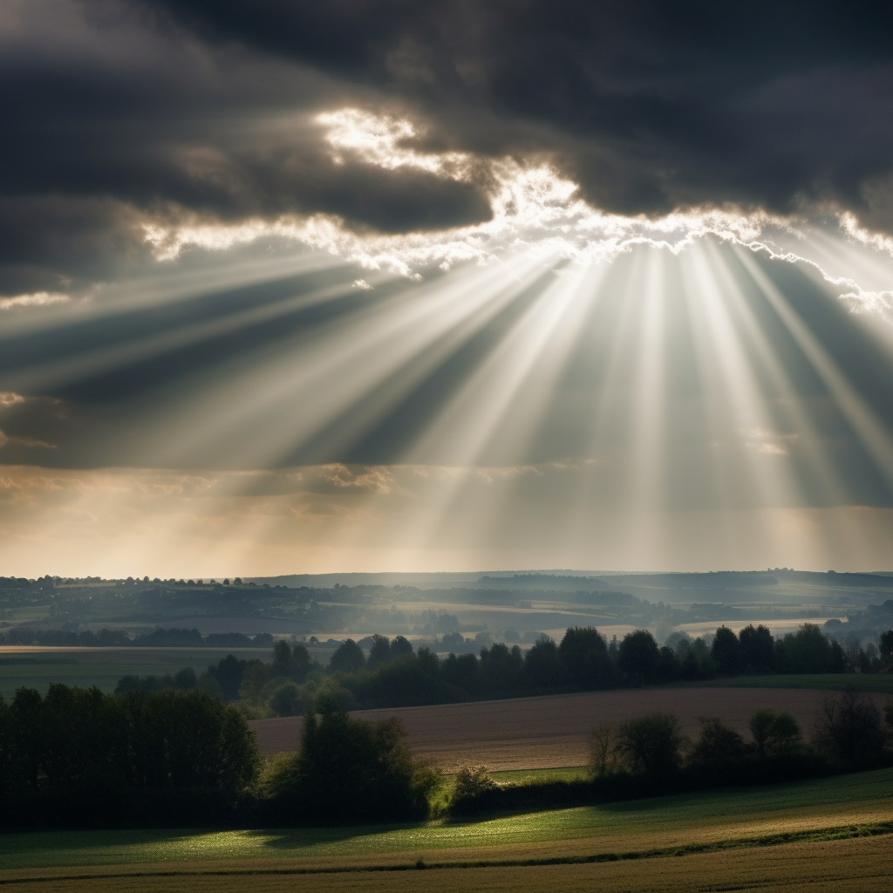

# 场景7：实物

## 让 ChatGPT 生成提示词是不是更好？

我有用 ChatGPT 辅助我生成提示词，但没有用 Role 模式，而是让它：

1. 翻译：我知道我想要的东西，但不知道其英文描述。
2. 解答：我需要一些风格词，但我不知道输入啥时，就会问 ChatGPT ，比如「文艺复兴时期的著名艺术家有哪些？」

我为何没有用 Role 模式？

的确，让 ChatGPT 以 Role 模式帮我生成内容，比较省时省力，但我个人觉得：

1. 使用比较麻烦，需要输入很多提示，即使通过 App 保存，在多次输入后，就会超过 token 限制，又要重新输入。
2. 从 ChatGPT 的原理上看，它只会生成一个「普通」的内容，很难获得超过预期的内容。只是说大多数人甚至连「普通」都达不到，所以才会震惊于它的效果。所以如果你想要生成原创惊艳的图，靠概率是不行的，要靠你的想象力。

不过，这也是我一家之言，如果你觉得这样效率更高，那就用吧~

没啥关系，适合自己的工具才是好工具。

## 玩具

OK 言归正传，从本章开始，我们会逐步丰富我们的 prompt 框架，让图片有更多的细节。实物生成的第一个是场景是玩具，是个非常有意思的场景。

另外，这个场景如果能跟 3D 打印机结合一下，我觉得会非常赞。不知道有没有有志之士能实现一下。

再解释下 prompt 有哪些更新，从实物这张开始，我讲「背景」调整为「环境」，即主体环境，包括背景、灯光等等：

|         | **Prompt**                        | **解释**                                           |
| ------- | --------------------------------- | ------------------------------------------------ |
| 类型是什么？  | product photography               | 产品照片                                             |
| 主体是什么？  | Stormtrooper, plastic, toy        | 继续用风暴兵和达斯维达为例。因为手办一般都是塑料玩具，所以加了两个词               |
| 环境是怎样的？ | white background, studio lighting | 背景：为了突出手办，强调一下白色背景 灯光：增加一些灯光，突出产品 |
| 构图是怎样的？ | null                              | 不太重要，就让 AI 自由发挥                                  |
| 用什么镜头？  | null                              | 不太重要，就让 AI 自由发挥                                  |
| 是什么风格？  | hand painted,                     | 我查了下，好像手办的风格应该只有手绘？                              |

另外一个是游戏王里的蓝眼白龙，可惜 Midjourney 并不知道啥是 Yu-Gi-Oh，只能按字面意思生成了一个：

|        | **Prompt**                           | **解释**                             |
| ------ | ------------------------------------ | ---------------------------------- |
| 主体是什么？ | Blue-Eyes White Dragon, plastic, toy | 继续用风暴兵和达斯维达为例。因为手办一般都是塑料玩具，所以加了两个词 |

以下是生成的图片：


另外，我发现 Midjourney 对美式动漫或电影作品支持会好很多，比如冰与火之歌里的龙妈（只是龙有点诡异），还有圣女贞德：


## 技巧十一：增加风格——国家

说到手办，大家应该第一反应会想起日本，再介绍一个技巧，在 prompt 里加入 Japanese style 即可，拿圣女贞德作手办，以及之前做的 logo 作为例子：


圣女贞德是不是有种 FF 的感觉？Logo 也比较简洁，猫的外观也有点像动漫里猫的外观，当然除了 Japanese 还有 Chinese（左边4张），甚至 African Style：


## 技巧十二：增加权重

各位有没有发现，上面那个 Chinese 手办生成的结果好像只有第三张是中国人面孔？原因是 Chinese style 的权重太低，所以仅输出了一个结果。你在实践的过程中，也肯定会遇到，AI 忽略了某些 prompt 词的情况，比如你提到画面中要有一只鸟，但它就是没画出来。

那为何会产生这样的结果？原因 Midjourney 的 prompt 权重是按照顺序逐个降低（详情请见我翻译的 Midjourney 官方 FAQ），在我们上面的 prompt，我们将 Chinese Style 放到了最后，所以生成的结果也是最少的。忽略了某些词，这个原因暂时为止，但应该很可能是权重导致的问题。

**增加权重的方法有很多，最简单的方法就是调整顺序**，比如将上面的 Chinese Style 放到最前面（然后生成的结果就是眯眯眼 style 了 🤣，我生成了两次，第二次好一些）：

```other
product photography, Chinese Style,Joan of Arc, full body, hand painted, plastic, detailed, white background, studio lighting
```

调整下顺序，效果就大不一样，所以各位不要迷信所谓的 prompt 模板，多试试。


**第二种方法是 Slider 方法。**

你需要在 prompt 最后加  ，然后加上你需要调整权重的词语，接着再加  ，最后加上权重值。比如还是上面的例子，我想突出 Chinese style 但不想调整顺序，就可以改为：

```other
product photography,Joan of Arc, full body, hand painted, plastic, detailed, white background, studio lighting, Chinese Style :: Chinese Style :: 0.5
```

然后你会发现，好像权重太高了，生成了跟 prompt 无关的图（下方左图），那我们可以在原来的基础上，再加以下 Joan of Arc 的权重（下方右图）：

```other
product photography,Joan of Arc, full body, hand painted, plastic, detailed, white background, studio lighting, Chinese Style :: Joan of Arc:: 0.25 style of Chinese:: 0.5
```

你可以看到，调整参数后，生成的 4 张图有 2 张具备较强的 Chinese 风格：


不过坦率说来，这个方法，并不特别适合这个案例，调整主体内容，或者顺序， ROI 会更高一些，这个方法更适合 miss 掉某个 prompt 词时使用，比如官方的案例是这样的：

```other
several sad cats watch a crying woman in a home-office environment with laptop
```

生成的图片里（左四张图），猫咪们都看着你（你可能才是 crying woman 😂），如果用 slider 的功能（右边四张），crying woman 就出现在画面里了：

```other
several sad cats watch a crying woman in a home-office environment with laptop:: several sad cats::0.5 crying woman::0.6 laptop::0.7
```

另外需要注意，slider 可用的参数有 0.25、0.5、0.6、0.7，也可以用这个方法降低权重，区间是 -0.7、-0.6、-0.5、-0.25：


如果你用了 slider 还是没有出现应该有的画面，**那还有一个大招 cowbell**，坦率说来，这个并不符合 Midjourney 的官方最佳实践，但的确是个可行的方法，以下面这个 prompt 为例，生成的图片里，woman 看起来并不 shy（左边四张图）：

```other
A songbird sits on the shoulder of a shy blonde woman dressed in white.
```

此时你可以重复重复再重复（我觉得这就是为何这个方法叫 cowbell 的原因）：

```other
A songbird sits on the shoulder shoulder shoulder shoulder shoulder shoulder of a shy shy shy shy shy shy shy blonde woman dressed in white.
```


## 食物

另一个我比较喜欢的实物是食物，食物讲究的是「色香味俱全」，所以在描述食物类的 prompt 时，可以往这三个方向想想：

- 色：食物是什么颜色的（可以通过食物的熟度来控制）。
- 香：照片没有香味，但我们可以把香气画出来。
- 味：照片也同样没有味道，那我们加一点细节装饰？比如撒上胡椒、盐、辣椒？

|         | **Prompt**                                                      | **解释**                           |
| ------- | --------------------------------------------------------------- | -------------------------------- |
| 类型是什么？  | food photography                                                | 食物照片                             |
| 主体是什么？  | steak, medium rare, steaming, light garnishes, sitting on plate | 牛排，五分熟，带蒸汽，仅有一点配菜，放在一个碟子上        |
| 环境是怎样的？ | epic lighting                                                   | 为了突出食物，我加了个聚光灯                   |
| 构图是怎样的？ | null                                                            | 不太重要，就让 AI 自由发挥                  |
| 用什么镜头？  | depth of field                                                  | 为了突出食物，我加了背景虚化，这是背景虚化的另一种表达（有景深） |
| 是什么风格？  | null                                                            | 不太重要，就让 AI 自由发挥                  |
| 参数      | null                                                            | 没有加任何参数                          |

然后再来一碗红烧牛肉面：


## 技巧十三：善用灯光

坦诚地跟大家说，我不是设计师，也不是摄影师（而且我非常不擅长摄影），所以我仅能跟大家分享一下基础内容，因为这个对我来说，太多过程性知识了，不实际操作过，根本不知道有什么。

言归正传，摄影中，常用摄影灯光有以下几种：

1. 主灯 (Key Light)：主灯是最基本的摄影灯光之一，通常放置在被拍摄物体的正前方或正侧方，用于照明主体，决定拍摄物体的主要明暗度。主灯通常是亮度最高的灯光。
2. 填光灯 (Fill Light)：填光灯用于弥补主灯照射的阴影部分，调整阴影的深浅程度，使照片明亮一些。通常填充光应该比主光暗一些，以避免出现过度曝光。
3. 逆光灯 (Back Light)：逆光灯用于照射被拍摄物体的背面，能够区别出主体和背景，并使物体轮廓变得清晰，常用于拍摄骨感、重物感和逆光效果的照片等。
4. 环境光 (Ambient Light)：环境光就是摄影环境自然产生的光线，包括室内照明、自然光、街灯等，它可以补充被拍摄物体的表面，提升照片的自然度和真实感。
5. 故事性灯光 (Special Light)：通常是为了制造出某种情境或者表达某种意义而使用的，例如烛光、亮光等。它们能够产生温暖、浪漫、神秘等场景和气氛，以探索和表达艺术的想象力和创造力。

基于这些灯进行排列组合，你会得到不同使用场景的灯光。灯光的细节种类，可以去我归纳的 Lighting List 里查看，我这里主要分享一些常用和易用的场景灯光：

| <div style={{width:180}}>**照片**</div> | **名称**                   | **介绍**                                                                                                                       | **适合场景**                                                                                                                                       |
| ------ | ------------------------ | ---------------------------------------------------------------------------------------------------------------------------- | -------------------------------------------------------------------------------------------------------- |
|      | Mood Lighting            | 氛围灯。主要是通过在特定的环境中改变灯光的颜色和亮度等参数来创造一种特定的氛围，以营造舒适、浪漫、放松等感觉。从技术实现上看，Mood lighting则着重于灯光的颜色和亮度控制，注重创造强烈的视觉效果。                  | Mood lighting通常用于室内设计、酒店、餐厅及居家装饰等领域，旨在创造出一种特定的气氛和体验。                                                                                           |
|       | Moody Lighting           | 情绪灯。它更强调在情感表达和为故事情节服务方面的应用，设计的目的是要把灯光与剧情完美结合起来，以展现角色的个性和情感世界。从技术实现上看，Moody lighting通常采用低亮度和大比例遮挡阴影，强调暗部的扫描，以增加画面的纹理和层次感。 | Moody lighting通常用于影视制作、游戏界面、舞台表演等领域，设计的目的是为了增加故事情节的戏剧效果。                                                                                       |
|        | Studio Lighting          | 工作室灯光。是一种专门用于摄影工作室、电视和电影等领域的照明设计。它将光源和灯具放置在一个专用的摄影工作室中，通过精细的照明来创造出各种不同的氛围和场景效果，以满足各种不同的拍摄需求。                                 | Studio lighting 主要应用于商业摄影、时装摄影、艺术摄影、人像摄影、广告拍摄、电影和电视制作等领域，目的是通过精细的照明设计来突出主体的特点，达到最佳的拍摄效果。                                                       |
|        | Cove Lighting            | 壁角灯。是一种常用的室内照明设计，其灯具通常安装在墙壁或吊顶壁橱之间的壁角（即“壁橱”)中，从而营造出舒适、柔和、光滑的环境照明效果。                                                          | 这种照明技术可以为房间提供均匀的光线，同时提高房间的美感和时尚度。                                                                                                              |
|        | Soft Lighting            | 柔和照明。是指通过使用柔和、漫射的光线来创造出柔和、温暖的氛围效果。柔和的光线通常是通过使用的漫射灯具来实现的，较为常见的是壁灯、台灯、阅读灯等。                                                    | 柔和照明效果可以降低照度，减轻视觉疲劳，创造出舒适的氛围和感觉。                                                                                                               |
|        | Hard Lighting            | 硬朗照明。是指通过使用聚光灯、筒灯等灯具来聚焦到一个特定的区域中，其光线是相对集中而直接的。                                                                               | 创造出刚硬、明亮的照明效果。硬朗照明常常用于展示场合，如美术馆、商场等环境，以突出展品或商品的特点和质感。                                                                                          |
|        | Volumetric Lighting      | 体积光。是一种创造逼真渲染效果的照明效果技术。它通过在某些场景中添加灯光和各种视觉效果，如扩散、雾、粒子、阴影等，在照明场景中模拟空气中的粒子和尘埃微粒的现象，从而创造出动态、逼真、增强立体感和体积感的照明效果。                   | 适用于多种场景设计中，如电影、电视、视频游戏、动画等领域。它可以让场景更加逼真、立体，增加场景的紧张度和视觉层次感，并带来更具有表现力的视觉效果。                                                                      |
|        | Low-Key Lighting         | 低键照明。指的是一种特殊的照明效果，该效果通常通过强烈的侧光或背光和阴影来创造高对比度的画面效果。低键照明的特点是明暗分明、阴影浓重、暗调占主导地位，常常构建一种紧张、神秘或黑暗的氛围。                                | 低键照明广泛应用于电影、电视、摄影等领域中，常常用来表现悬疑、恐怖、犯罪等要素。                                                                                                       |
|        | High-Key Lighting        | 高键照明。这种照明效果通过使用明亮、均匀的光线来避免明暗对比并压低阴影的出现。这种照明效果特点是亮度高、细节丰富，适用于需要传递愉悦、轻松和开心氛围的场景和环境。                                            | 高键照明通常用于广告、情感电影、电视剧等中。                                                                                                                         |
|        | Epic Light               | 史诗光线。是一种创建极富戏剧性、威严感和视觉效果的照明技术，它可以在场景中添加非常亮烈、盛大、壮观的光线，以吸引观众注意力并增加场景的震撼力。                                                      | Epic Light通常用于影视制作、游戏开发、演出等领域中，以营造出一种崇高、壮丽、宏伟的氛围，可以使观众在看到这些效果时，感到非常震撼和难以忘怀。史诗光线的特点是亮度较高、颜色鲜艳，通常用于表现重要的剧情点，如武器的激光、宇宙战争中的太阳和星星、幻想电影和电子游戏中的神秘光芒等。 |
|        | Rembrandt Lighting       | 伦勃朗特效是一种起源于荷兰画家伦勃朗的照明效果，其主要特点是在人物脸部形成一个菱形的明暗分界线，嘴巴和下巴的一侧用阴影覆盖，人物的另一侧则被亮光照亮。                                                  | 能营造出一种柔和而神秘的效果。                                                                                                                                |
|        | Contre-Jour              | 逆光照明。指的是摄影师将光源放置在被摄物体的背后，令照射效果在镜头前面产生，形成被摄体轮廓明显的负片形态。                                                                        | 于光源位置造成的暗摄影整体的虚化，高对比度和鲜明的轮廓线可以带来文艺和抽象的氛围。                                                                                                      |
|        | Veiling Flare            | 透镜毛玻璃。指当光线从透镜或镜头穿过时，透过玻璃或镜头的反光或散射使得图像出现散射光线或最终成像看起来失真的现象。                                                                    |                                                                                                                                                |
|        | Crepuscular Rays         | 黎明、黄昏光线。也称为太阳光柱，是由日光在云层或尘埃中被反射形成的光线束。因为只有在日出和日落时才有足够的光线穿过云层或照射到恰当的夹角，所以Crepuscular Rays通常只出现在日出和日落时刻。                        | Crepuscular Rays通常会在云层上形成明显的束状光线，给人以美丽的感觉。                                                                                                     |
|        | Rays of Shimmering Light | 闪烁光线。是指在光线散射和折射时出现的光线折射现象。在某些特定的环境下，光线经过不同密度和温度不同的气氛，会出现一种光线折射、散射的效果，从而形成闪烁光束效果。                                             |                                                                                                                                                |
|        | Godrays                  | 神光。是一种由光线穿过云朵、树枝或其他障碍物时，形成的亮光条纹效果。Godrays通常在光线较强的时分出现，将光线分割成条纹状，形成一种梦幻般的效果，也被称为 "crepuscular rays" 的一种。                      |                                                                                                                                                |

